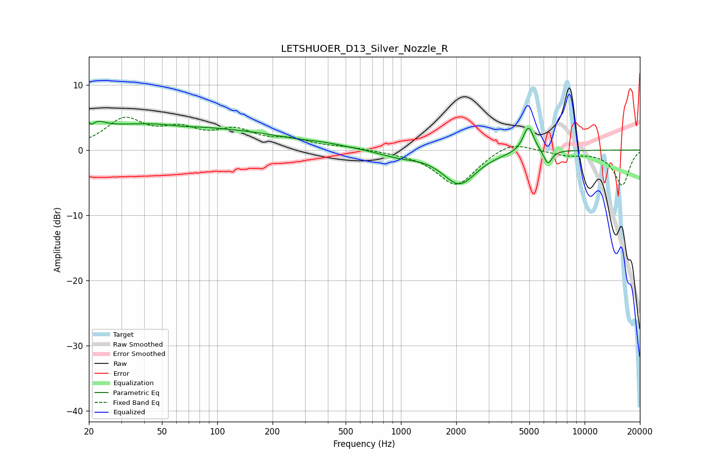

# LETSHUOER_D13_Silver_Nozzle_R
See [usage instructions](https://github.com/jaakkopasanen/AutoEq#usage) for more options and info.

### Parametric EQs
Apply preamp of -4.5 dB when using parametric equalizer.

|   # | Type    |   Fc (Hz) |    Q |   Gain (dB) |
|-----|---------|-----------|------|-------------|
|   1 | Peaking |        20 | 3.13 |         4.1 |
|   2 | Peaking |        20 | 5.96 |        -2.8 |
|   3 | Peaking |        44 | 0.37 |         3.8 |
|   4 | Peaking |        64 | 1.66 |        -0.3 |
|   5 | Peaking |       169 | 0.63 |         1.2 |
|   6 | Peaking |       384 | 1.08 |         0.5 |
|   7 | Peaking |       974 | 1.29 |        -0.8 |
|   8 | Peaking |      2081 | 1.53 |        -5.1 |
|   9 | Peaking |      4948 | 4.75 |         4   |
|  10 | Peaking |      6308 | 6    |        -2.2 |

### Fixed Band EQs
When using fixed band (also called graphic) equalizer, apply preamp of **-5.1 dB** (if available) and set gains manually with these parameters.

|   # | Type    |   Fc (Hz) |    Q |   Gain (dB) |
|-----|---------|-----------|------|-------------|
|   1 | Peaking |        31 | 1.41 |         4.4 |
|   2 | Peaking |        62 | 1.41 |         2.6 |
|   3 | Peaking |       125 | 1.41 |         2.6 |
|   4 | Peaking |       250 | 1.41 |         1.4 |
|   5 | Peaking |       500 | 1.41 |         0.4 |
|   6 | Peaking |      1000 | 1.41 |        -0.2 |
|   7 | Peaking |      2000 | 1.41 |        -5.5 |
|   8 | Peaking |      4000 | 1.41 |         1.6 |
|   9 | Peaking |      8000 | 1.41 |        -0.7 |
|  10 | Peaking |     16000 | 1.41 |        -5.4 |

### Graphs

