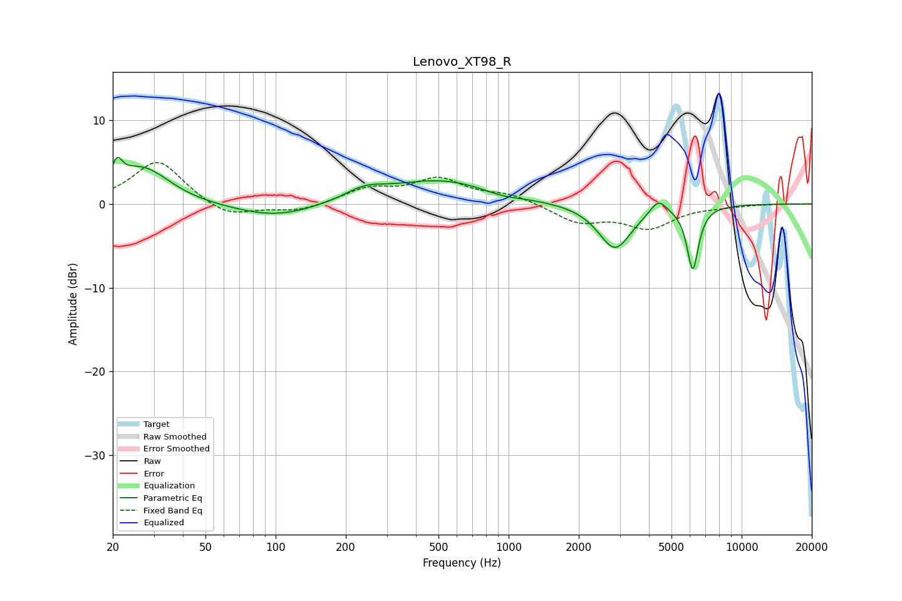

# Lenovo_XT98_R
See [usage instructions](https://github.com/jaakkopasanen/AutoEq#usage) for more options and info.

### Parametric EQs
Apply preamp of -5.6 dB when using parametric equalizer.

|   # | Type    |   Fc (Hz) |    Q |   Gain (dB) |
|-----|---------|-----------|------|-------------|
|   1 | Peaking |        21 | 5.96 |         2.8 |
|   2 | Peaking |        24 | 2.54 |         0.8 |
|   3 | Peaking |        28 | 1.3  |         3.7 |
|   4 | Peaking |       100 | 0.79 |        -1.7 |
|   5 | Peaking |       241 | 1.6  |         1.3 |
|   6 | Peaking |       511 | 0.65 |         2.8 |
|   7 | Peaking |       935 | 1.83 |        -0.5 |
|   8 | Peaking |      2860 | 1.98 |        -5.4 |
|   9 | Peaking |      4393 | 4    |         1.7 |
|  10 | Peaking |      6167 | 5.52 |        -7.6 |

### Fixed Band EQs
When using fixed band (also called graphic) equalizer, apply preamp of **-5.0 dB** (if available) and set gains manually with these parameters.

|   # | Type    |   Fc (Hz) |    Q |   Gain (dB) |
|-----|---------|-----------|------|-------------|
|   1 | Peaking |        31 | 1.41 |         5.2 |
|   2 | Peaking |        62 | 1.41 |        -1.7 |
|   3 | Peaking |       125 | 1.41 |        -0.9 |
|   4 | Peaking |       250 | 1.41 |         1.7 |
|   5 | Peaking |       500 | 1.41 |         2.8 |
|   6 | Peaking |      1000 | 1.41 |         1   |
|   7 | Peaking |      2000 | 1.41 |        -2.1 |
|   8 | Peaking |      4000 | 1.41 |        -2.7 |
|   9 | Peaking |      8000 | 1.41 |        -0.2 |
|  10 | Peaking |     16000 | 1.41 |         0   |

### Graphs

