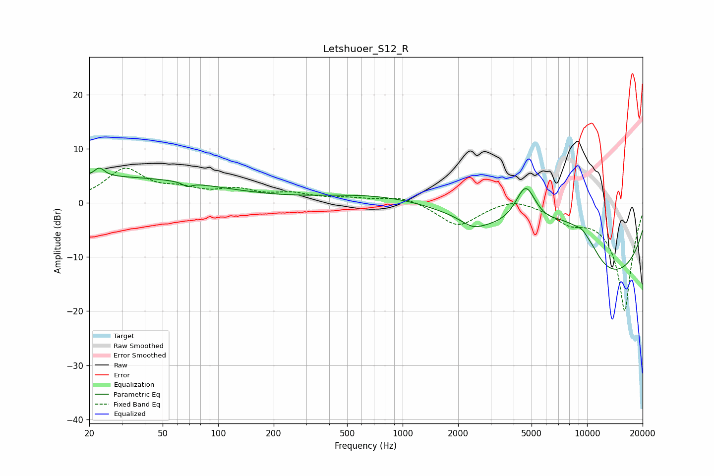

# Letshuoer_S12_R
See [usage instructions](https://github.com/jaakkopasanen/AutoEq#usage) for more options and info.

### Parametric EQs
Apply preamp of -6.5 dB when using parametric equalizer.

|   # | Type    |   Fc (Hz) |    Q |   Gain (dB) |
|-----|---------|-----------|------|-------------|
|   1 | Peaking |        21 | 0.18 |         4.8 |
|   2 | Peaking |        23 | 5.31 |         1.6 |
|   3 | Peaking |        68 | 5.84 |        -0.8 |
|   4 | Peaking |      2226 | 0.2  |         3.5 |
|   5 | Peaking |      2410 | 2.24 |        -1.6 |
|   6 | Peaking |      4649 | 2.22 |         8.7 |
|   7 | Peaking |      7569 | 0.9  |         8.2 |
|   8 | Peaking |      9931 | 2.38 |         8.2 |
|   9 | Peaking |     10000 | 3.32 |        -4.5 |
|  10 | Peaking |     10000 | 0.23 |       -17.5 |

### Fixed Band EQs
When using fixed band (also called graphic) equalizer, apply preamp of **-6.5 dB** (if available) and set gains manually with these parameters.

|   # | Type    |   Fc (Hz) |    Q |   Gain (dB) |
|-----|---------|-----------|------|-------------|
|   1 | Peaking |        31 | 1.41 |         6   |
|   2 | Peaking |        62 | 1.41 |         1.8 |
|   3 | Peaking |       125 | 1.41 |         2   |
|   4 | Peaking |       250 | 1.41 |         1.4 |
|   5 | Peaking |       500 | 1.41 |         0.7 |
|   6 | Peaking |      1000 | 1.41 |         1.3 |
|   7 | Peaking |      2000 | 1.41 |        -4.3 |
|   8 | Peaking |      4000 | 1.41 |         1.3 |
|   9 | Peaking |      8000 | 1.41 |        -2.6 |
|  10 | Peaking |     16000 | 1.41 |       -20   |

### Graphs

