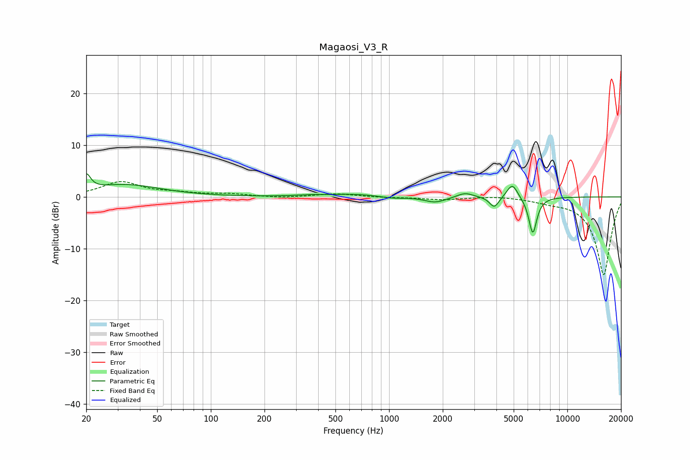

# Magaosi_V3_R
See [usage instructions](https://github.com/jaakkopasanen/AutoEq#usage) for more options and info.

### Parametric EQs
Apply preamp of -4.6 dB when using parametric equalizer.

|   # | Type    |   Fc (Hz) |    Q |   Gain (dB) |
|-----|---------|-----------|------|-------------|
|   1 | Peaking |        20 | 5.99 |         3   |
|   2 | Peaking |        33 | 0.72 |         2.3 |
|   3 | Peaking |       361 | 1.62 |         0.2 |
|   4 | Peaking |       631 | 1.07 |         0.5 |
|   5 | Peaking |      1039 | 2.39 |        -0.3 |
|   6 | Peaking |      1815 | 2.35 |        -1.1 |
|   7 | Peaking |      2669 | 3.17 |         0.9 |
|   8 | Peaking |      3893 | 5.41 |        -2.2 |
|   9 | Peaking |      4912 | 4.6  |         2.8 |
|  10 | Peaking |      6399 | 5.99 |        -7.2 |

### Fixed Band EQs
When using fixed band (also called graphic) equalizer, apply preamp of **-3.1 dB** (if available) and set gains manually with these parameters.

|   # | Type    |   Fc (Hz) |    Q |   Gain (dB) |
|-----|---------|-----------|------|-------------|
|   1 | Peaking |        31 | 1.41 |         2.8 |
|   2 | Peaking |        62 | 1.41 |         0.6 |
|   3 | Peaking |       125 | 1.41 |         0.5 |
|   4 | Peaking |       250 | 1.41 |        -0.2 |
|   5 | Peaking |       500 | 1.41 |         0.6 |
|   6 | Peaking |      1000 | 1.41 |        -0.1 |
|   7 | Peaking |      2000 | 1.41 |        -0.5 |
|   8 | Peaking |      4000 | 1.41 |         0.3 |
|   9 | Peaking |      8000 | 1.41 |        -0.6 |
|  10 | Peaking |     16000 | 1.41 |       -15.1 |

### Graphs

