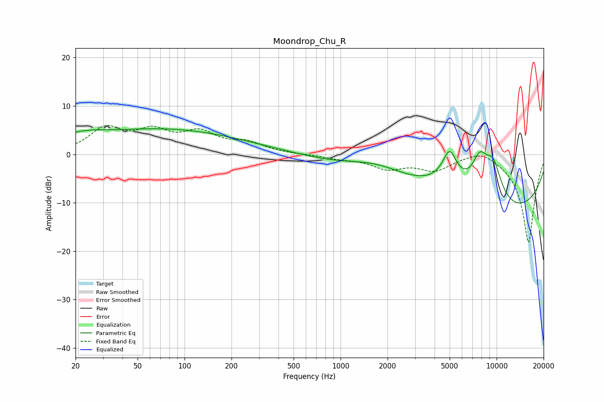

# Moondrop_Chu_R
See [usage instructions](https://github.com/jaakkopasanen/AutoEq#usage) for more options and info.

### Parametric EQs
Apply preamp of -5.4 dB when using parametric equalizer.

|   # | Type    |   Fc (Hz) |    Q |   Gain (dB) |
|-----|---------|-----------|------|-------------|
|   1 | Peaking |        20 | 1.52 |         0.5 |
|   2 | Peaking |        26 | 1.87 |         0.4 |
|   3 | Peaking |        44 | 0.22 |         4   |
|   4 | Peaking |       135 | 0.29 |         1.7 |
|   5 | Peaking |      1718 | 0.68 |         4   |
|   6 | Peaking |      4997 | 3    |         6.5 |
|   7 | Peaking |      5193 | 0.52 |         6.3 |
|   8 | Peaking |      7638 | 0.18 |       -15.2 |
|   9 | Peaking |      7811 | 2.59 |         6.5 |
|  10 | Peaking |      9497 | 2.21 |         7.6 |

### Fixed Band EQs
When using fixed band (also called graphic) equalizer, apply preamp of **-6.1 dB** (if available) and set gains manually with these parameters.

|   # | Type    |   Fc (Hz) |    Q |   Gain (dB) |
|-----|---------|-----------|------|-------------|
|   1 | Peaking |        31 | 1.41 |         5   |
|   2 | Peaking |        62 | 1.41 |         4.1 |
|   3 | Peaking |       125 | 1.41 |         4   |
|   4 | Peaking |       250 | 1.41 |         2.1 |
|   5 | Peaking |       500 | 1.41 |        -0   |
|   6 | Peaking |      1000 | 1.41 |        -0.7 |
|   7 | Peaking |      2000 | 1.41 |        -2.6 |
|   8 | Peaking |      4000 | 1.41 |        -2.9 |
|   9 | Peaking |      8000 | 1.41 |         1.6 |
|  10 | Peaking |     16000 | 1.41 |       -18.3 |

### Graphs

