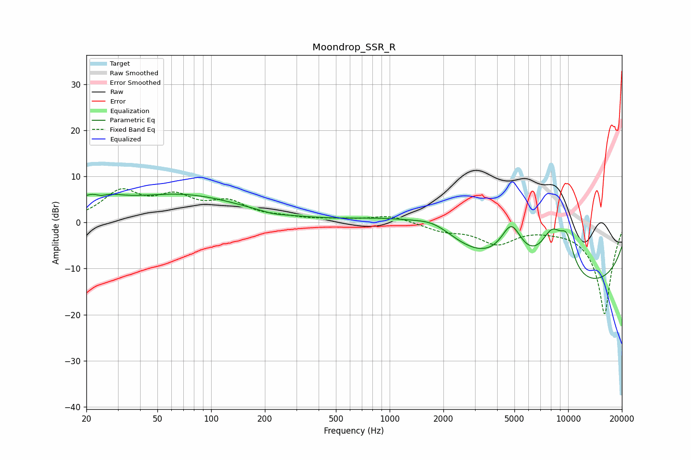

# Moondrop_SSR_R
See [usage instructions](https://github.com/jaakkopasanen/AutoEq#usage) for more options and info.

### Parametric EQs
Apply preamp of -6.2 dB when using parametric equalizer.

|   # | Type    |   Fc (Hz) |    Q |   Gain (dB) |
|-----|---------|-----------|------|-------------|
|   1 | Peaking |        22 | 1.15 |         4.2 |
|   2 | Peaking |        24 | 4.69 |        -0.8 |
|   3 | Peaking |        70 | 0.42 |         5.7 |
|   4 | Peaking |       221 | 2    |        -0.5 |
|   5 | Peaking |      1138 | 0.61 |         2.8 |
|   6 | Peaking |      1787 | 1.21 |         3.2 |
|   7 | Peaking |      4807 | 2.15 |         9   |
|   8 | Peaking |      8124 | 1.78 |         9.6 |
|   9 | Peaking |      9799 | 0.18 |       -14.7 |
|  10 | Peaking |      9812 | 2.98 |         6.5 |

### Fixed Band EQs
When using fixed band (also called graphic) equalizer, apply preamp of **-7.4 dB** (if available) and set gains manually with these parameters.

|   # | Type    |   Fc (Hz) |    Q |   Gain (dB) |
|-----|---------|-----------|------|-------------|
|   1 | Peaking |        31 | 1.41 |         6.3 |
|   2 | Peaking |        62 | 1.41 |         4.7 |
|   3 | Peaking |       125 | 1.41 |         3.8 |
|   4 | Peaking |       250 | 1.41 |         0.8 |
|   5 | Peaking |       500 | 1.41 |         0.5 |
|   6 | Peaking |      1000 | 1.41 |         1.5 |
|   7 | Peaking |      2000 | 1.41 |        -1.6 |
|   8 | Peaking |      4000 | 1.41 |        -4.2 |
|   9 | Peaking |      8000 | 1.41 |        -0.5 |
|  10 | Peaking |     16000 | 1.41 |       -20   |

### Graphs

