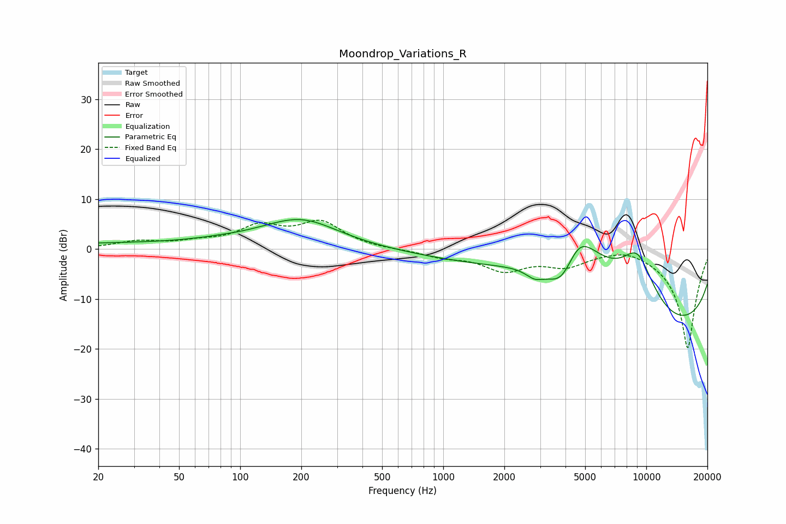

# Moondrop_Variations_R
See [usage instructions](https://github.com/jaakkopasanen/AutoEq#usage) for more options and info.

### Parametric EQs
Apply preamp of -6.0 dB when using parametric equalizer.

|   # | Type    |   Fc (Hz) |    Q |   Gain (dB) |
|-----|---------|-----------|------|-------------|
|   1 | Peaking |        33 | 0.2  |         1.1 |
|   2 | Peaking |        59 | 4.11 |         0   |
|   3 | Peaking |        79 | 2.35 |         0.1 |
|   4 | Peaking |       147 | 0.59 |         0.8 |
|   5 | Peaking |       202 | 0.78 |         4.9 |
|   6 | Peaking |      2824 | 3.11 |        -1.8 |
|   7 | Peaking |      3868 | 1.6  |        -9.2 |
|   8 | Peaking |      4604 | 0.81 |        20   |
|   9 | Peaking |      9051 | 1.3  |        11.8 |
|  10 | Peaking |     10000 | 0.19 |       -19.8 |

### Fixed Band EQs
When using fixed band (also called graphic) equalizer, apply preamp of **-5.9 dB** (if available) and set gains manually with these parameters.

|   # | Type    |   Fc (Hz) |    Q |   Gain (dB) |
|-----|---------|-----------|------|-------------|
|   1 | Peaking |        31 | 1.41 |         1.4 |
|   2 | Peaking |        62 | 1.41 |         1.1 |
|   3 | Peaking |       125 | 1.41 |         4.1 |
|   4 | Peaking |       250 | 1.41 |         5   |
|   5 | Peaking |       500 | 1.41 |        -0.1 |
|   6 | Peaking |      1000 | 1.41 |        -1.3 |
|   7 | Peaking |      2000 | 1.41 |        -3.9 |
|   8 | Peaking |      4000 | 1.41 |        -2.9 |
|   9 | Peaking |      8000 | 1.41 |         1.1 |
|  10 | Peaking |     16000 | 1.41 |       -20   |

### Graphs

