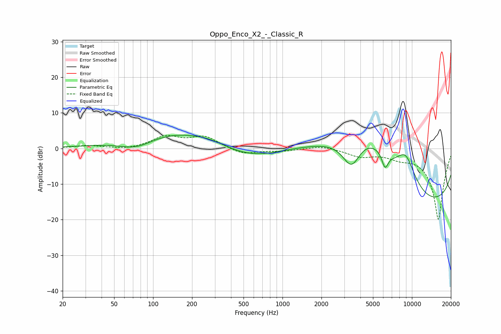

# Oppo_Enco_X2_-_Classic_R
See [usage instructions](https://github.com/jaakkopasanen/AutoEq#usage) for more options and info.

### Parametric EQs
Apply preamp of -3.8 dB when using parametric equalizer.

|   # | Type    |   Fc (Hz) |    Q |   Gain (dB) |
|-----|---------|-----------|------|-------------|
|   1 | Peaking |        75 | 1.02 |        -3.4 |
|   2 | Peaking |       131 | 0.39 |         5   |
|   3 | Peaking |       268 | 1.09 |         0.9 |
|   4 | Peaking |       563 | 0.61 |        -3.4 |
|   5 | Peaking |      3413 | 1.76 |       -10   |
|   6 | Peaking |      3719 | 0.41 |        16.4 |
|   7 | Peaking |      4955 | 0.92 |         4.4 |
|   8 | Peaking |      6196 | 5.58 |        -4.3 |
|   9 | Peaking |      8960 | 1.64 |         8.5 |
|  10 | Peaking |     10000 | 0.18 |       -20   |

### Fixed Band EQs
When using fixed band (also called graphic) equalizer, apply preamp of **-3.8 dB** (if available) and set gains manually with these parameters.

|   # | Type    |   Fc (Hz) |    Q |   Gain (dB) |
|-----|---------|-----------|------|-------------|
|   1 | Peaking |        31 | 1.41 |         0.8 |
|   2 | Peaking |        62 | 1.41 |        -0.5 |
|   3 | Peaking |       125 | 1.41 |         3.2 |
|   4 | Peaking |       250 | 1.41 |         3.2 |
|   5 | Peaking |       500 | 1.41 |        -1.8 |
|   6 | Peaking |      1000 | 1.41 |        -0.7 |
|   7 | Peaking |      2000 | 1.41 |         0.9 |
|   8 | Peaking |      4000 | 1.41 |        -2   |
|   9 | Peaking |      8000 | 1.41 |        -1.7 |
|  10 | Peaking |     16000 | 1.41 |       -20   |

### Graphs

