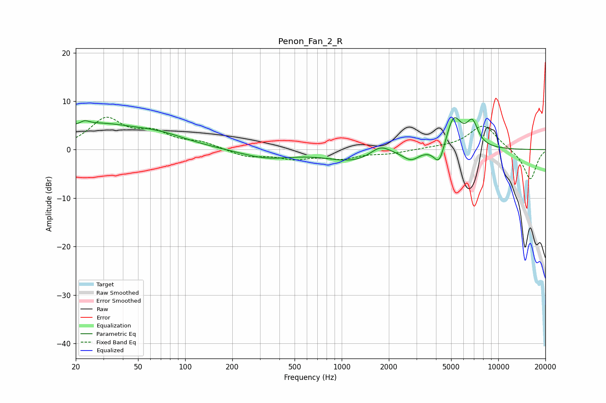

# Penon_Fan_2_R
See [usage instructions](https://github.com/jaakkopasanen/AutoEq#usage) for more options and info.

### Parametric EQs
Apply preamp of -6.7 dB when using parametric equalizer.

|   # | Type    |   Fc (Hz) |    Q |   Gain (dB) |
|-----|---------|-----------|------|-------------|
|   1 | Peaking |        23 | 5.89 |         0.6 |
|   2 | Peaking |        25 | 0.43 |         5.2 |
|   3 | Peaking |        72 | 0.83 |         1.4 |
|   4 | Peaking |       331 | 0.86 |        -1.7 |
|   5 | Peaking |      1187 | 0.85 |        -2.3 |
|   6 | Peaking |      1766 | 2.25 |         2.1 |
|   7 | Peaking |      2773 | 2.7  |        -2   |
|   8 | Peaking |      4203 | 3.98 |        -4.5 |
|   9 | Peaking |      5179 | 2.76 |         7   |
|  10 | Peaking |      6832 | 3.66 |         4.8 |

### Fixed Band EQs
When using fixed band (also called graphic) equalizer, apply preamp of **-6.8 dB** (if available) and set gains manually with these parameters.

|   # | Type    |   Fc (Hz) |    Q |   Gain (dB) |
|-----|---------|-----------|------|-------------|
|   1 | Peaking |        31 | 1.41 |         6.1 |
|   2 | Peaking |        62 | 1.41 |         3   |
|   3 | Peaking |       125 | 1.41 |         1.3 |
|   4 | Peaking |       250 | 1.41 |        -1.4 |
|   5 | Peaking |       500 | 1.41 |        -1.6 |
|   6 | Peaking |      1000 | 1.41 |        -1.6 |
|   7 | Peaking |      2000 | 1.41 |        -0.7 |
|   8 | Peaking |      4000 | 1.41 |         0.3 |
|   9 | Peaking |      8000 | 1.41 |         5.2 |
|  10 | Peaking |     16000 | 1.41 |        -6.3 |

### Graphs

