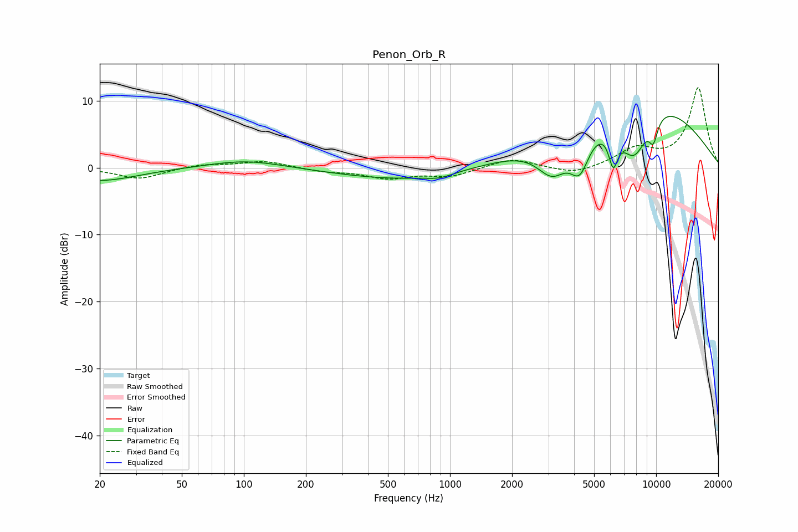

# Penon_Orb_R
See [usage instructions](https://github.com/jaakkopasanen/AutoEq#usage) for more options and info.

### Parametric EQs
Apply preamp of -7.8 dB when using parametric equalizer.

|   # | Type    |   Fc (Hz) |    Q |   Gain (dB) |
|-----|---------|-----------|------|-------------|
|   1 | Peaking |        20 | 0.77 |        -2   |
|   2 | Peaking |       102 | 0.78 |         1.2 |
|   3 | Peaking |       613 | 0.45 |        -1.9 |
|   4 | Peaking |       890 | 2.33 |        -0.6 |
|   5 | Peaking |      3140 | 1.81 |        -5.3 |
|   6 | Peaking |      4261 | 2.87 |        -5.7 |
|   7 | Peaking |      6192 | 5.98 |        -5.1 |
|   8 | Peaking |      7800 | 1.58 |       -10.5 |
|   9 | Peaking |      8013 | 0.43 |        13.8 |
|  10 | Peaking |      9696 | 5.82 |        -3.3 |

### Fixed Band EQs
When using fixed band (also called graphic) equalizer, apply preamp of **-12.0 dB** (if available) and set gains manually with these parameters.

|   # | Type    |   Fc (Hz) |    Q |   Gain (dB) |
|-----|---------|-----------|------|-------------|
|   1 | Peaking |        31 | 1.41 |        -1.7 |
|   2 | Peaking |        62 | 1.41 |         0.5 |
|   3 | Peaking |       125 | 1.41 |         1   |
|   4 | Peaking |       250 | 1.41 |        -0.5 |
|   5 | Peaking |       500 | 1.41 |        -1.5 |
|   6 | Peaking |      1000 | 1.41 |        -1.2 |
|   7 | Peaking |      2000 | 1.41 |         1.4 |
|   8 | Peaking |      4000 | 1.41 |        -1.1 |
|   9 | Peaking |      8000 | 1.41 |         2.6 |
|  10 | Peaking |     16000 | 1.41 |        11.9 |

### Graphs

