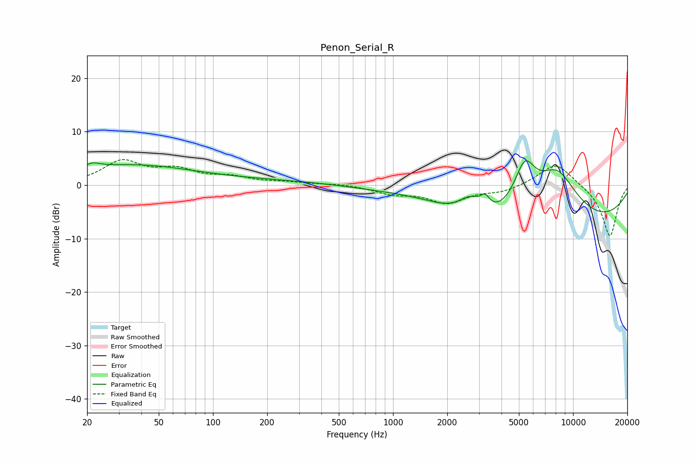

# Penon_Serial_R
See [usage instructions](https://github.com/jaakkopasanen/AutoEq#usage) for more options and info.

### Parametric EQs
Apply preamp of -4.6 dB when using parametric equalizer.

|   # | Type    |   Fc (Hz) |    Q |   Gain (dB) |
|-----|---------|-----------|------|-------------|
|   1 | Peaking |        20 | 3.68 |        -2.7 |
|   2 | Peaking |        21 | 3.33 |         3.7 |
|   3 | Peaking |        35 | 0.41 |         3.6 |
|   4 | Peaking |       441 | 0.21 |         0.9 |
|   5 | Peaking |      1502 | 0.62 |         2.8 |
|   6 | Peaking |      2676 | 2.15 |         3.4 |
|   7 | Peaking |      3244 | 5.33 |         2.1 |
|   8 | Peaking |      5383 | 2.12 |         9.1 |
|   9 | Peaking |      6153 | 0.21 |       -13.7 |
|  10 | Peaking |      8125 | 0.84 |        13.9 |

### Fixed Band EQs
When using fixed band (also called graphic) equalizer, apply preamp of **-4.9 dB** (if available) and set gains manually with these parameters.

|   # | Type    |   Fc (Hz) |    Q |   Gain (dB) |
|-----|---------|-----------|------|-------------|
|   1 | Peaking |        31 | 1.41 |         4.2 |
|   2 | Peaking |        62 | 1.41 |         2.5 |
|   3 | Peaking |       125 | 1.41 |         1.3 |
|   4 | Peaking |       250 | 1.41 |         0.4 |
|   5 | Peaking |       500 | 1.41 |         0.3 |
|   6 | Peaking |      1000 | 1.41 |        -1.5 |
|   7 | Peaking |      2000 | 1.41 |        -3.1 |
|   8 | Peaking |      4000 | 1.41 |        -1.1 |
|   9 | Peaking |      8000 | 1.41 |         4.3 |
|  10 | Peaking |     16000 | 1.41 |        -9.7 |

### Graphs

