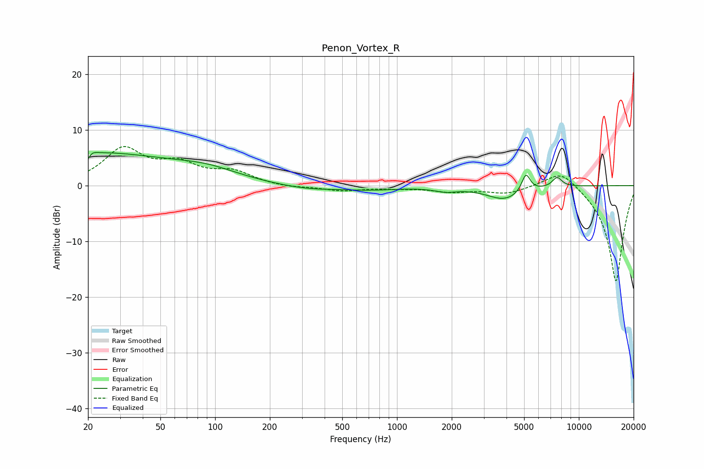

# Penon_Vortex_R
See [usage instructions](https://github.com/jaakkopasanen/AutoEq#usage) for more options and info.

### Parametric EQs
Apply preamp of -6.0 dB when using parametric equalizer.

|   # | Type    |   Fc (Hz) |    Q |   Gain (dB) |
|-----|---------|-----------|------|-------------|
|   1 | Peaking |        20 | 0.29 |         5.8 |
|   2 | Peaking |        20 | 5.99 |        -4.4 |
|   3 | Peaking |        20 | 5.84 |         3.3 |
|   4 | Peaking |        91 | 0.8  |         1.7 |
|   5 | Peaking |       320 | 0.83 |        -0.8 |
|   6 | Peaking |       720 | 0.89 |        -0.6 |
|   7 | Peaking |      1847 | 2.29 |        -0.7 |
|   8 | Peaking |      3918 | 1.4  |        -2.5 |
|   9 | Peaking |      5118 | 5.86 |         3.3 |
|  10 | Peaking |      7595 | 4.95 |         1.8 |

### Fixed Band EQs
When using fixed band (also called graphic) equalizer, apply preamp of **-7.1 dB** (if available) and set gains manually with these parameters.

|   # | Type    |   Fc (Hz) |    Q |   Gain (dB) |
|-----|---------|-----------|------|-------------|
|   1 | Peaking |        31 | 1.41 |         6.3 |
|   2 | Peaking |        62 | 1.41 |         3.3 |
|   3 | Peaking |       125 | 1.41 |         2.2 |
|   4 | Peaking |       250 | 1.41 |        -0.4 |
|   5 | Peaking |       500 | 1.41 |        -0.9 |
|   6 | Peaking |      1000 | 1.41 |        -0.4 |
|   7 | Peaking |      2000 | 1.41 |        -1   |
|   8 | Peaking |      4000 | 1.41 |        -1.3 |
|   9 | Peaking |      8000 | 1.41 |         3.3 |
|  10 | Peaking |     16000 | 1.41 |       -17.4 |

### Graphs

