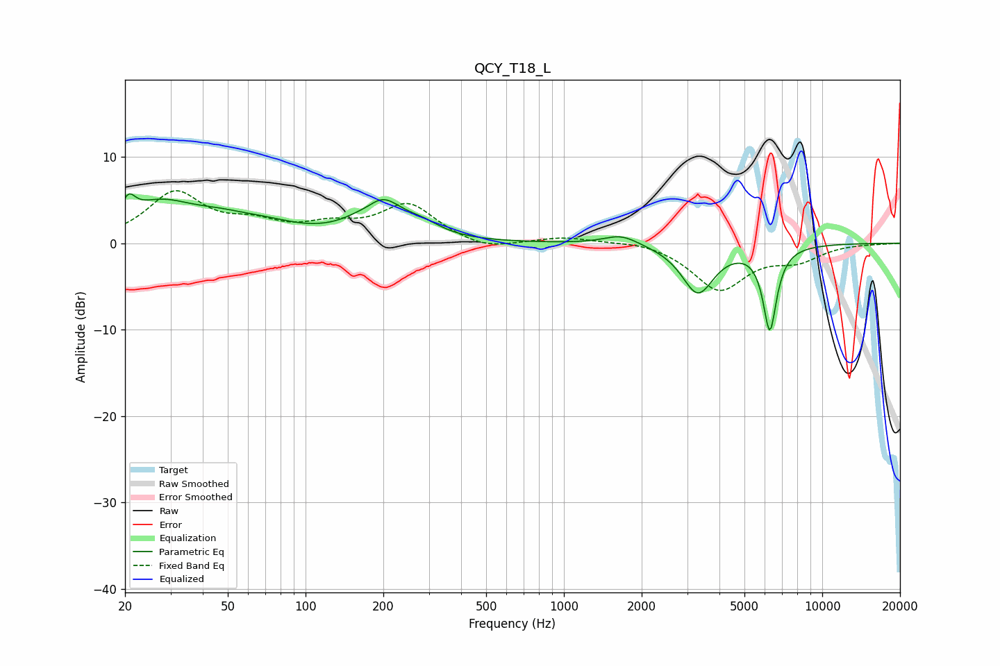

# QCY_T18_L
See [usage instructions](https://github.com/jaakkopasanen/AutoEq#usage) for more options and info.

### Parametric EQs
Apply preamp of -5.8 dB when using parametric equalizer.

|   # | Type    |   Fc (Hz) |    Q |   Gain (dB) |
|-----|---------|-----------|------|-------------|
|   1 | Peaking |        21 | 5.62 |         2.1 |
|   2 | Peaking |        27 | 1.02 |         4.1 |
|   3 | Peaking |        46 | 1.22 |         1.3 |
|   4 | Peaking |        70 | 1.01 |         1.4 |
|   5 | Peaking |       179 | 2.73 |        -1.3 |
|   6 | Peaking |       191 | 1.67 |         5.5 |
|   7 | Peaking |       285 | 1.98 |         1.1 |
|   8 | Peaking |      1666 | 2.11 |         1.2 |
|   9 | Peaking |      3301 | 2.26 |        -5.7 |
|  10 | Peaking |      6268 | 5.19 |        -9.6 |

### Fixed Band EQs
When using fixed band (also called graphic) equalizer, apply preamp of **-6.2 dB** (if available) and set gains manually with these parameters.

|   # | Type    |   Fc (Hz) |    Q |   Gain (dB) |
|-----|---------|-----------|------|-------------|
|   1 | Peaking |        31 | 1.41 |         5.6 |
|   2 | Peaking |        62 | 1.41 |         1.8 |
|   3 | Peaking |       125 | 1.41 |         1.6 |
|   4 | Peaking |       250 | 1.41 |         4.3 |
|   5 | Peaking |       500 | 1.41 |        -1   |
|   6 | Peaking |      1000 | 1.41 |         0.7 |
|   7 | Peaking |      2000 | 1.41 |         0.4 |
|   8 | Peaking |      4000 | 1.41 |        -5.3 |
|   9 | Peaking |      8000 | 1.41 |        -1.7 |
|  10 | Peaking |     16000 | 1.41 |        -0   |

### Graphs

