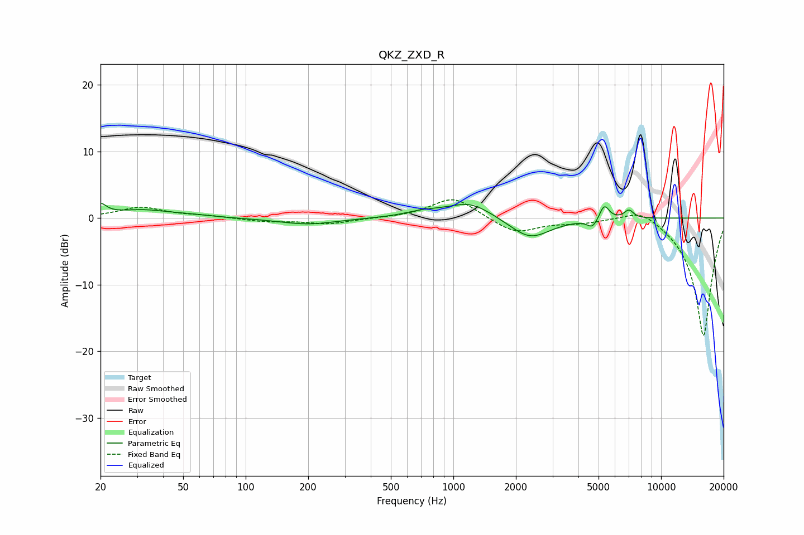

# QKZ_ZXD_R
See [usage instructions](https://github.com/jaakkopasanen/AutoEq#usage) for more options and info.

### Parametric EQs
Apply preamp of -2.3 dB when using parametric equalizer.

|   # | Type    |   Fc (Hz) |    Q |   Gain (dB) |
|-----|---------|-----------|------|-------------|
|   1 | Peaking |        20 | 5.01 |         1.6 |
|   2 | Peaking |        32 | 1.03 |         1.2 |
|   3 | Peaking |        55 | 1.45 |         0.2 |
|   4 | Peaking |       199 | 1.02 |        -1   |
|   5 | Peaking |       718 | 1.55 |         0.7 |
|   6 | Peaking |      1204 | 1.31 |         2.4 |
|   7 | Peaking |      2338 | 1.45 |        -3.2 |
|   8 | Peaking |      4676 | 5.64 |        -1.3 |
|   9 | Peaking |      5328 | 6    |         2.3 |
|  10 | Peaking |      6998 | 6    |         1.2 |

### Fixed Band EQs
When using fixed band (also called graphic) equalizer, apply preamp of **-2.8 dB** (if available) and set gains manually with these parameters.

|   # | Type    |   Fc (Hz) |    Q |   Gain (dB) |
|-----|---------|-----------|------|-------------|
|   1 | Peaking |        31 | 1.41 |         1.6 |
|   2 | Peaking |        62 | 1.41 |         0.3 |
|   3 | Peaking |       125 | 1.41 |        -0.5 |
|   4 | Peaking |       250 | 1.41 |        -0.9 |
|   5 | Peaking |       500 | 1.41 |        -0   |
|   6 | Peaking |      1000 | 1.41 |         3.2 |
|   7 | Peaking |      2000 | 1.41 |        -2.3 |
|   8 | Peaking |      4000 | 1.41 |        -0.6 |
|   9 | Peaking |      8000 | 1.41 |         1.9 |
|  10 | Peaking |     16000 | 1.41 |       -17.9 |

### Graphs

