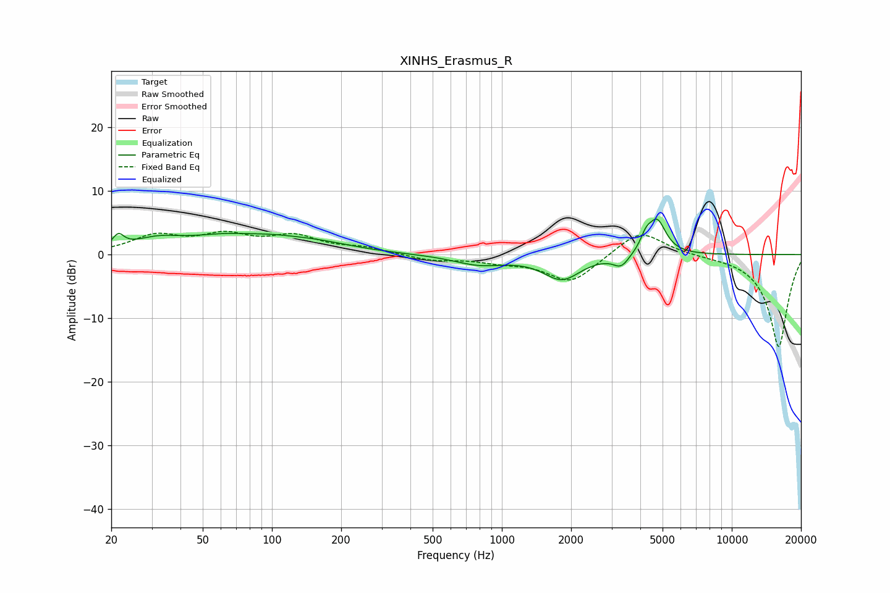

# XINHS_Erasmus_R
See [usage instructions](https://github.com/jaakkopasanen/AutoEq#usage) for more options and info.

### Parametric EQs
Apply preamp of -5.7 dB when using parametric equalizer.

|   # | Type    |   Fc (Hz) |    Q |   Gain (dB) |
|-----|---------|-----------|------|-------------|
|   1 | Peaking |        21 | 5.99 |         1.9 |
|   2 | Peaking |        31 | 1.38 |         1.6 |
|   3 | Peaking |        75 | 0.65 |         3.4 |
|   4 | Peaking |        78 | 1.58 |        -0.5 |
|   5 | Peaking |       163 | 0.93 |         0.9 |
|   6 | Peaking |       799 | 1.25 |        -1.5 |
|   7 | Peaking |      1825 | 1.74 |        -3.8 |
|   8 | Peaking |      3305 | 4.15 |        -1.8 |
|   9 | Peaking |      4230 | 6    |         1.9 |
|  10 | Peaking |      4732 | 3.64 |         5.3 |

### Fixed Band EQs
When using fixed band (also called graphic) equalizer, apply preamp of **-3.8 dB** (if available) and set gains manually with these parameters.

|   # | Type    |   Fc (Hz) |    Q |   Gain (dB) |
|-----|---------|-----------|------|-------------|
|   1 | Peaking |        31 | 1.41 |         2.7 |
|   2 | Peaking |        62 | 1.41 |         2.7 |
|   3 | Peaking |       125 | 1.41 |         2.6 |
|   4 | Peaking |       250 | 1.41 |         0.9 |
|   5 | Peaking |       500 | 1.41 |        -0.9 |
|   6 | Peaking |      1000 | 1.41 |        -0.9 |
|   7 | Peaking |      2000 | 1.41 |        -4.4 |
|   8 | Peaking |      4000 | 1.41 |         4.1 |
|   9 | Peaking |      8000 | 1.41 |        -0.1 |
|  10 | Peaking |     16000 | 1.41 |       -14.6 |

### Graphs

