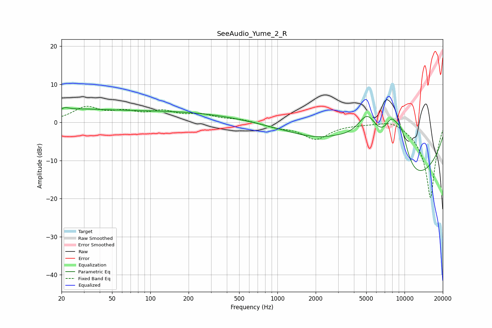

# SeeAudio_Yume_2_R
See [usage instructions](https://github.com/jaakkopasanen/AutoEq#usage) for more options and info.

### Parametric EQs
Apply preamp of -4.0 dB when using parametric equalizer.

|   # | Type    |   Fc (Hz) |    Q |   Gain (dB) |
|-----|---------|-----------|------|-------------|
|   1 | Peaking |        21 | 5.42 |        -2.7 |
|   2 | Peaking |        21 | 4.89 |         3.5 |
|   3 | Peaking |        24 | 0.78 |         1.2 |
|   4 | Peaking |       102 | 0.19 |         3.6 |
|   5 | Peaking |       161 | 0.2  |        -0.7 |
|   6 | Peaking |      2978 | 1.09 |         1.7 |
|   7 | Peaking |      5116 | 1.25 |        12.9 |
|   8 | Peaking |      7915 | 1.98 |         9.8 |
|   9 | Peaking |      9274 | 0.29 |       -19.2 |
|  10 | Peaking |      9485 | 2.09 |         9.2 |

### Fixed Band EQs
When using fixed band (also called graphic) equalizer, apply preamp of **-4.3 dB** (if available) and set gains manually with these parameters.

|   # | Type    |   Fc (Hz) |    Q |   Gain (dB) |
|-----|---------|-----------|------|-------------|
|   1 | Peaking |        31 | 1.41 |         3.7 |
|   2 | Peaking |        62 | 1.41 |         2.2 |
|   3 | Peaking |       125 | 1.41 |         2.4 |
|   4 | Peaking |       250 | 1.41 |         1.7 |
|   5 | Peaking |       500 | 1.41 |         0.7 |
|   6 | Peaking |      1000 | 1.41 |        -1.1 |
|   7 | Peaking |      2000 | 1.41 |        -4.2 |
|   8 | Peaking |      4000 | 1.41 |        -0.2 |
|   9 | Peaking |      8000 | 1.41 |         1.4 |
|  10 | Peaking |     16000 | 1.41 |       -20   |

### Graphs

