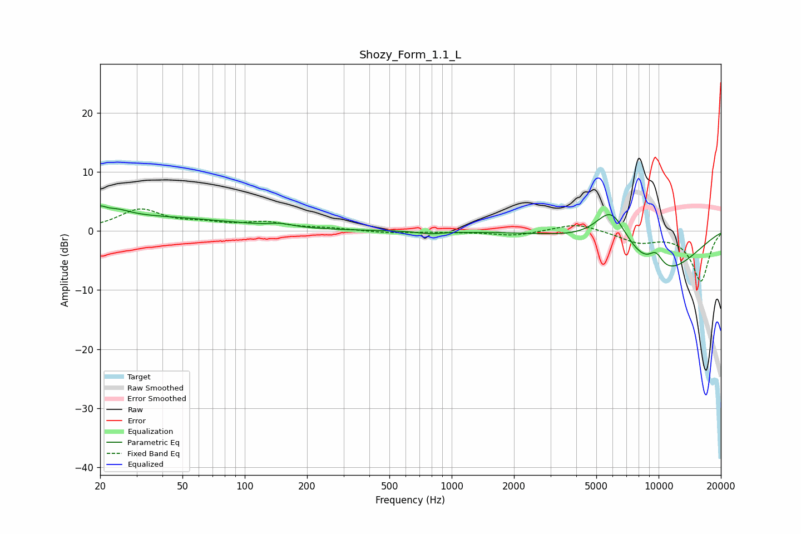

# Shozy_Form_1.1_L
See [usage instructions](https://github.com/jaakkopasanen/AutoEq#usage) for more options and info.

### Parametric EQs
Apply preamp of -4.3 dB when using parametric equalizer.

|   # | Type    |   Fc (Hz) |    Q |   Gain (dB) |
|-----|---------|-----------|------|-------------|
|   1 | Peaking |        20 | 5.6  |         1.2 |
|   2 | Peaking |        24 | 2.17 |         1.1 |
|   3 | Peaking |        27 | 0.27 |         2.4 |
|   4 | Peaking |       149 | 2.63 |         0.5 |
|   5 | Peaking |       786 | 2.56 |        -0.4 |
|   6 | Peaking |      1225 | 2.73 |        -0.1 |
|   7 | Peaking |      5918 | 1.68 |         7.1 |
|   8 | Peaking |      9641 | 3.03 |         1.3 |
|   9 | Peaking |      9722 | 3.85 |         1.4 |
|  10 | Peaking |     10000 | 0.59 |        -7.7 |

### Fixed Band EQs
When using fixed band (also called graphic) equalizer, apply preamp of **-3.8 dB** (if available) and set gains manually with these parameters.

|   # | Type    |   Fc (Hz) |    Q |   Gain (dB) |
|-----|---------|-----------|------|-------------|
|   1 | Peaking |        31 | 1.41 |         3.5 |
|   2 | Peaking |        62 | 1.41 |         1   |
|   3 | Peaking |       125 | 1.41 |         1.3 |
|   4 | Peaking |       250 | 1.41 |         0.4 |
|   5 | Peaking |       500 | 1.41 |        -0.3 |
|   6 | Peaking |      1000 | 1.41 |        -0.1 |
|   7 | Peaking |      2000 | 1.41 |        -0.8 |
|   8 | Peaking |      4000 | 1.41 |         1.4 |
|   9 | Peaking |      8000 | 1.41 |        -1.8 |
|  10 | Peaking |     16000 | 1.41 |        -8.5 |

### Graphs

