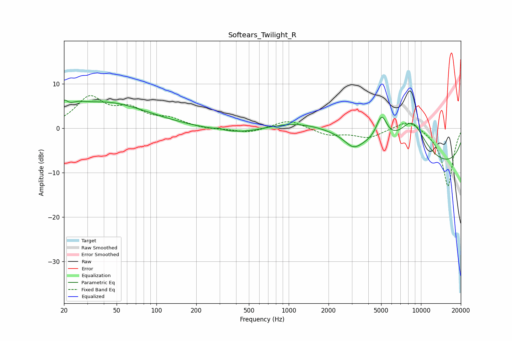

# Softears_Twilight_R
See [usage instructions](https://github.com/jaakkopasanen/AutoEq#usage) for more options and info.

### Parametric EQs
Apply preamp of -6.4 dB when using parametric equalizer.

|   # | Type    |   Fc (Hz) |    Q |   Gain (dB) |
|-----|---------|-----------|------|-------------|
|   1 | Peaking |        20 | 5.64 |         2   |
|   2 | Peaking |        25 | 2.34 |         1   |
|   3 | Peaking |        41 | 0.44 |         5.7 |
|   4 | Peaking |       296 | 5.82 |         0.3 |
|   5 | Peaking |       466 | 0.64 |        -2.4 |
|   6 | Peaking |      1646 | 0.31 |         4   |
|   7 | Peaking |      3078 | 2.26 |        -2.4 |
|   8 | Peaking |      5039 | 3.23 |         6   |
|   9 | Peaking |      8575 | 1.12 |         9.2 |
|  10 | Peaking |     10000 | 0.18 |        -9.4 |

### Fixed Band EQs
When using fixed band (also called graphic) equalizer, apply preamp of **-7.4 dB** (if available) and set gains manually with these parameters.

|   # | Type    |   Fc (Hz) |    Q |   Gain (dB) |
|-----|---------|-----------|------|-------------|
|   1 | Peaking |        31 | 1.41 |         6.6 |
|   2 | Peaking |        62 | 1.41 |         3.7 |
|   3 | Peaking |       125 | 1.41 |         1.8 |
|   4 | Peaking |       250 | 1.41 |        -0.3 |
|   5 | Peaking |       500 | 1.41 |        -1.1 |
|   6 | Peaking |      1000 | 1.41 |         2   |
|   7 | Peaking |      2000 | 1.41 |        -1.5 |
|   8 | Peaking |      4000 | 1.41 |        -2   |
|   9 | Peaking |      8000 | 1.41 |         2.3 |
|  10 | Peaking |     16000 | 1.41 |       -13.2 |

### Graphs

