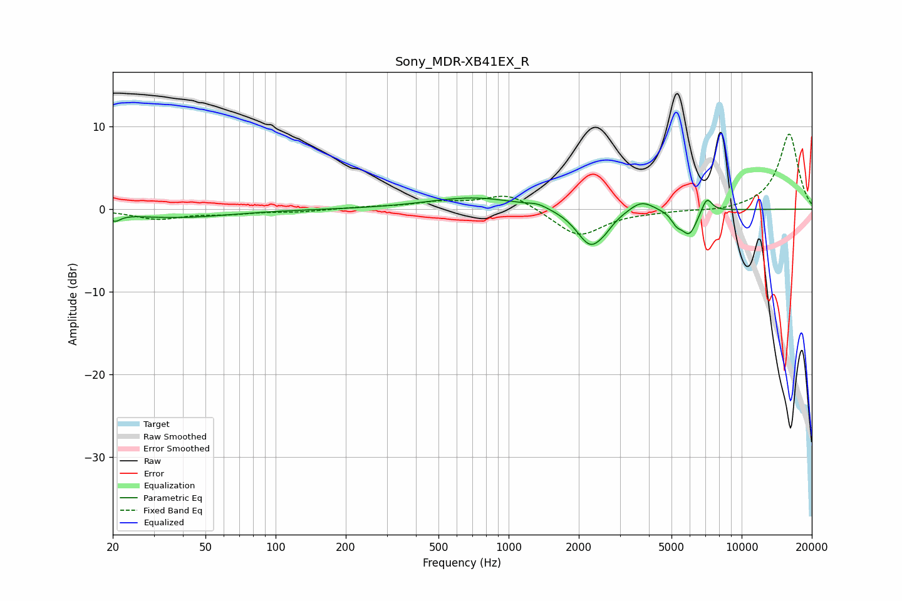

# Sony_MDR-XB41EX_R
See [usage instructions](https://github.com/jaakkopasanen/AutoEq#usage) for more options and info.

### Parametric EQs
Apply preamp of -1.5 dB when using parametric equalizer.

|   # | Type    |   Fc (Hz) |    Q |   Gain (dB) |
|-----|---------|-----------|------|-------------|
|   1 | Peaking |        20 | 5.99 |        -0.9 |
|   2 | Peaking |        37 | 0.61 |        -1   |
|   3 | Peaking |       710 | 0.73 |         1.4 |
|   4 | Peaking |      1337 | 3.35 |         0.4 |
|   5 | Peaking |      2247 | 2.36 |        -4.5 |
|   6 | Peaking |      2594 | 4.43 |        -0.5 |
|   7 | Peaking |      3715 | 2.64 |         1.4 |
|   8 | Peaking |      5261 | 6    |        -1.2 |
|   9 | Peaking |      5962 | 4.12 |        -3   |
|  10 | Peaking |      7084 | 5.96 |         1.9 |

### Fixed Band EQs
When using fixed band (also called graphic) equalizer, apply preamp of **-9.2 dB** (if available) and set gains manually with these parameters.

|   # | Type    |   Fc (Hz) |    Q |   Gain (dB) |
|-----|---------|-----------|------|-------------|
|   1 | Peaking |        31 | 1.41 |        -1.1 |
|   2 | Peaking |        62 | 1.41 |        -0.5 |
|   3 | Peaking |       125 | 1.41 |        -0.3 |
|   4 | Peaking |       250 | 1.41 |         0.2 |
|   5 | Peaking |       500 | 1.41 |         0.7 |
|   6 | Peaking |      1000 | 1.41 |         2   |
|   7 | Peaking |      2000 | 1.41 |        -3.4 |
|   8 | Peaking |      4000 | 1.41 |        -0.2 |
|   9 | Peaking |      8000 | 1.41 |        -0.3 |
|  10 | Peaking |     16000 | 1.41 |         9.2 |

### Graphs

