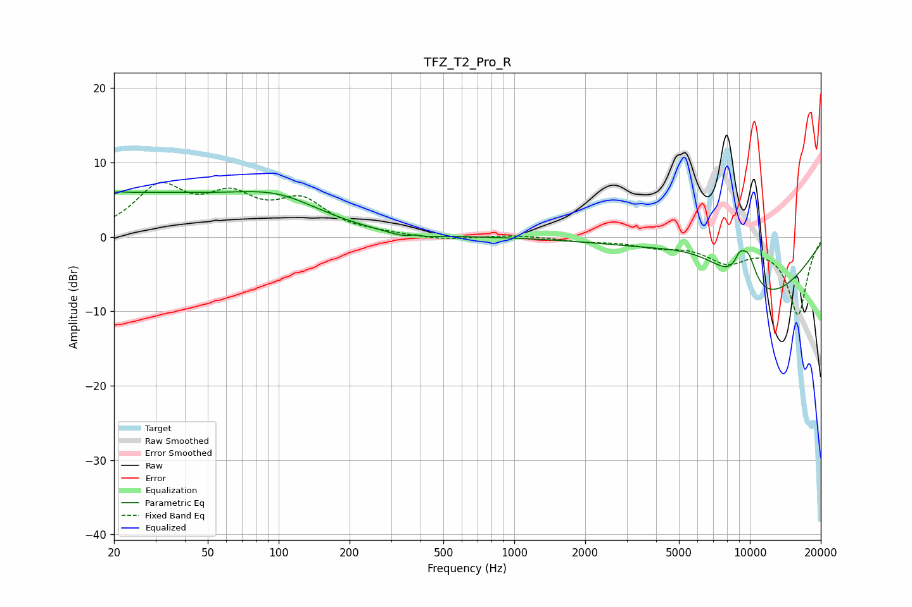

# TFZ_T2_Pro_R
See [usage instructions](https://github.com/jaakkopasanen/AutoEq#usage) for more options and info.

### Parametric EQs
Apply preamp of -6.2 dB when using parametric equalizer.

|   # | Type    |   Fc (Hz) |    Q |   Gain (dB) |
|-----|---------|-----------|------|-------------|
|   1 | Peaking |        21 | 4.77 |         0.2 |
|   2 | Peaking |        23 | 0.24 |         5.7 |
|   3 | Peaking |       101 | 0.79 |         2.8 |
|   4 | Peaking |       358 | 1.76 |        -0.8 |
|   5 | Peaking |       379 | 5.8  |         0.4 |
|   6 | Peaking |      6569 | 0.62 |         5.8 |
|   7 | Peaking |      8936 | 5.25 |         0.2 |
|   8 | Peaking |      9044 | 5.68 |         1.8 |
|   9 | Peaking |      9713 | 0.43 |       -11.4 |
|  10 | Peaking |      9834 | 3.45 |         4.5 |

### Fixed Band EQs
When using fixed band (also called graphic) equalizer, apply preamp of **-7.4 dB** (if available) and set gains manually with these parameters.

|   # | Type    |   Fc (Hz) |    Q |   Gain (dB) |
|-----|---------|-----------|------|-------------|
|   1 | Peaking |        31 | 1.41 |         6.3 |
|   2 | Peaking |        62 | 1.41 |         4.5 |
|   3 | Peaking |       125 | 1.41 |         4.4 |
|   4 | Peaking |       250 | 1.41 |         0.3 |
|   5 | Peaking |       500 | 1.41 |        -0.5 |
|   6 | Peaking |      1000 | 1.41 |         0.3 |
|   7 | Peaking |      2000 | 1.41 |        -0.5 |
|   8 | Peaking |      4000 | 1.41 |        -1   |
|   9 | Peaking |      8000 | 1.41 |        -3   |
|  10 | Peaking |     16000 | 1.41 |       -10.4 |

### Graphs

