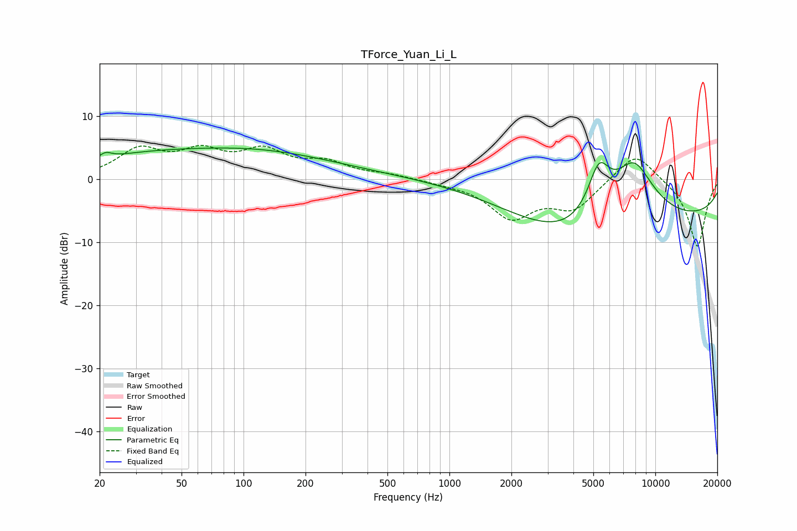

# TForce_Yuan_Li_L
See [usage instructions](https://github.com/jaakkopasanen/AutoEq#usage) for more options and info.

### Parametric EQs
Apply preamp of -5.1 dB when using parametric equalizer.

|   # | Type    |   Fc (Hz) |    Q |   Gain (dB) |
|-----|---------|-----------|------|-------------|
|   1 | Peaking |        21 | 5.06 |         0.9 |
|   2 | Peaking |        28 | 0.49 |         2.4 |
|   3 | Peaking |       112 | 0.36 |         4.7 |
|   4 | Peaking |       112 | 0.29 |        -1.3 |
|   5 | Peaking |       116 | 0.18 |         0.9 |
|   6 | Peaking |       119 | 1.96 |         0   |
|   7 | Peaking |      3912 | 0.49 |        -4.8 |
|   8 | Peaking |      5323 | 2.46 |         7.9 |
|   9 | Peaking |      7838 | 1.21 |        10.2 |
|  10 | Peaking |     10000 | 0.18 |        -6.3 |

### Fixed Band EQs
When using fixed band (also called graphic) equalizer, apply preamp of **-5.5 dB** (if available) and set gains manually with these parameters.

|   # | Type    |   Fc (Hz) |    Q |   Gain (dB) |
|-----|---------|-----------|------|-------------|
|   1 | Peaking |        31 | 1.41 |         4.4 |
|   2 | Peaking |        62 | 1.41 |         3.8 |
|   3 | Peaking |       125 | 1.41 |         4   |
|   4 | Peaking |       250 | 1.41 |         2.3 |
|   5 | Peaking |       500 | 1.41 |         0.7 |
|   6 | Peaking |      1000 | 1.41 |        -0.4 |
|   7 | Peaking |      2000 | 1.41 |        -5.8 |
|   8 | Peaking |      4000 | 1.41 |        -4.4 |
|   9 | Peaking |      8000 | 1.41 |         4.7 |
|  10 | Peaking |     16000 | 1.41 |       -10.8 |

### Graphs

