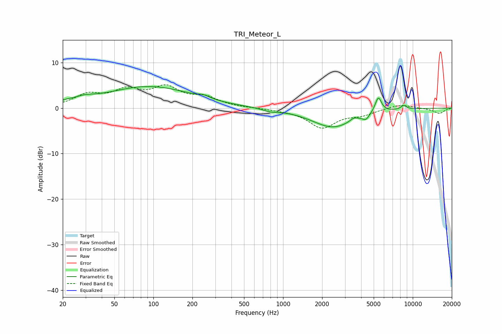

# TRI_Meteor_L
See [usage instructions](https://github.com/jaakkopasanen/AutoEq#usage) for more options and info.

### Parametric EQs
Apply preamp of -4.8 dB when using parametric equalizer.

|   # | Type    |   Fc (Hz) |    Q |   Gain (dB) |
|-----|---------|-----------|------|-------------|
|   1 | Peaking |        21 | 2.28 |         0.4 |
|   2 | Peaking |        29 | 1.8  |         0.9 |
|   3 | Peaking |        92 | 0.43 |         4.7 |
|   4 | Peaking |       243 | 3.28 |         0.6 |
|   5 | Peaking |       803 | 2.36 |        -0.5 |
|   6 | Peaking |      2424 | 0.86 |        -4.2 |
|   7 | Peaking |      3507 | 4.97 |         0.7 |
|   8 | Peaking |      4355 | 5.64 |        -1.1 |
|   9 | Peaking |      5425 | 5.6  |         3.4 |
|  10 | Peaking |      8523 | 6    |         0.9 |

### Fixed Band EQs
When using fixed band (also called graphic) equalizer, apply preamp of **-5.2 dB** (if available) and set gains manually with these parameters.

|   # | Type    |   Fc (Hz) |    Q |   Gain (dB) |
|-----|---------|-----------|------|-------------|
|   1 | Peaking |        31 | 1.41 |         2.7 |
|   2 | Peaking |        62 | 1.41 |         3.4 |
|   3 | Peaking |       125 | 1.41 |         4   |
|   4 | Peaking |       250 | 1.41 |         2   |
|   5 | Peaking |       500 | 1.41 |         0   |
|   6 | Peaking |      1000 | 1.41 |        -0.3 |
|   7 | Peaking |      2000 | 1.41 |        -4.2 |
|   8 | Peaking |      4000 | 1.41 |        -1.3 |
|   9 | Peaking |      8000 | 1.41 |         0.9 |
|  10 | Peaking |     16000 | 1.41 |        -1.2 |

### Graphs

