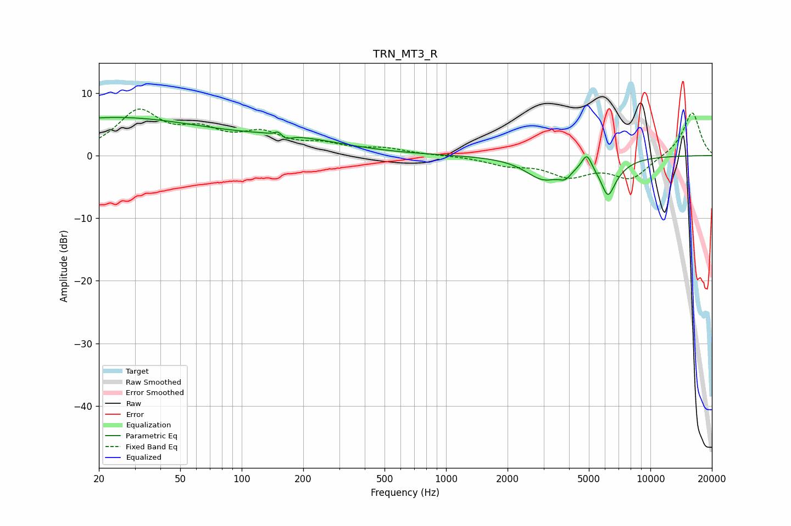

# TRN_MT3_R
See [usage instructions](https://github.com/jaakkopasanen/AutoEq#usage) for more options and info.

### Parametric EQs
Apply preamp of -6.2 dB when using parametric equalizer.

|   # | Type    |   Fc (Hz) |    Q |   Gain (dB) |
|-----|---------|-----------|------|-------------|
|   1 | Peaking |        23 | 0.29 |         6   |
|   2 | Peaking |       146 | 6    |        -1.4 |
|   3 | Peaking |       149 | 5.72 |         2.4 |
|   4 | Peaking |       161 | 4.9  |        -1.1 |
|   5 | Peaking |       179 | 0.54 |         2.1 |
|   6 | Peaking |      2999 | 1.6  |        -3.5 |
|   7 | Peaking |      3835 | 4.44 |        -1.5 |
|   8 | Peaking |      4888 | 5.92 |         2.5 |
|   9 | Peaking |      6189 | 4.84 |        -3.2 |
|  10 | Peaking |      6328 | 2.09 |        -2.8 |

### Fixed Band EQs
When using fixed band (also called graphic) equalizer, apply preamp of **-7.5 dB** (if available) and set gains manually with these parameters.

|   # | Type    |   Fc (Hz) |    Q |   Gain (dB) |
|-----|---------|-----------|------|-------------|
|   1 | Peaking |        31 | 1.41 |         6.7 |
|   2 | Peaking |        62 | 1.41 |         3.1 |
|   3 | Peaking |       125 | 1.41 |         3   |
|   4 | Peaking |       250 | 1.41 |         1.4 |
|   5 | Peaking |       500 | 1.41 |         1   |
|   6 | Peaking |      1000 | 1.41 |         0   |
|   7 | Peaking |      2000 | 1.41 |        -1.3 |
|   8 | Peaking |      4000 | 1.41 |        -3   |
|   9 | Peaking |      8000 | 1.41 |        -3.6 |
|  10 | Peaking |     16000 | 1.41 |         7   |

### Graphs

