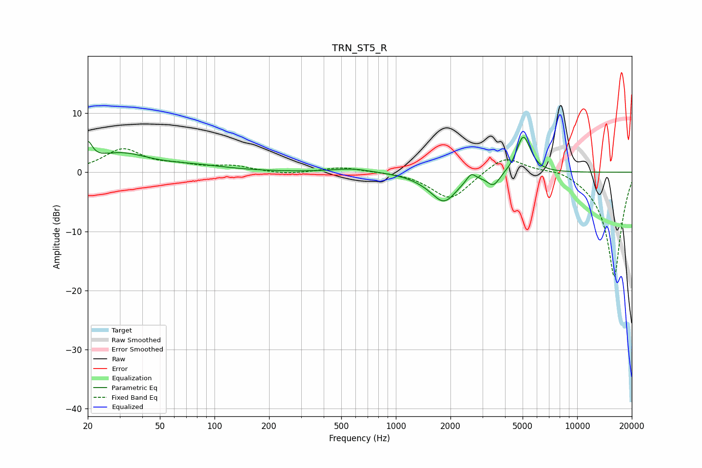

# TRN_ST5_R
See [usage instructions](https://github.com/jaakkopasanen/AutoEq#usage) for more options and info.

### Parametric EQs
Apply preamp of -6.0 dB when using parametric equalizer.

|   # | Type    |   Fc (Hz) |    Q |   Gain (dB) |
|-----|---------|-----------|------|-------------|
|   1 | Peaking |        20 | 5.81 |         3.3 |
|   2 | Peaking |        30 | 0.92 |         3   |
|   3 | Peaking |        78 | 0.75 |         0.9 |
|   4 | Peaking |       570 | 1.37 |         0.7 |
|   5 | Peaking |      1434 | 1.67 |        -0.5 |
|   6 | Peaking |      1846 | 2.01 |        -4.7 |
|   7 | Peaking |      2601 | 6    |         1.3 |
|   8 | Peaking |      3456 | 4.01 |        -2.2 |
|   9 | Peaking |      5000 | 3.93 |         4.8 |
|  10 | Peaking |      5246 | 3.57 |         1.7 |

### Fixed Band EQs
When using fixed band (also called graphic) equalizer, apply preamp of **-4.1 dB** (if available) and set gains manually with these parameters.

|   # | Type    |   Fc (Hz) |    Q |   Gain (dB) |
|-----|---------|-----------|------|-------------|
|   1 | Peaking |        31 | 1.41 |         3.8 |
|   2 | Peaking |        62 | 1.41 |         0.9 |
|   3 | Peaking |       125 | 1.41 |         1   |
|   4 | Peaking |       250 | 1.41 |        -0.4 |
|   5 | Peaking |       500 | 1.41 |         0.9 |
|   6 | Peaking |      1000 | 1.41 |         0.1 |
|   7 | Peaking |      2000 | 1.41 |        -4.7 |
|   8 | Peaking |      4000 | 1.41 |         3.1 |
|   9 | Peaking |      8000 | 1.41 |         0.9 |
|  10 | Peaking |     16000 | 1.41 |       -17.8 |

### Graphs

