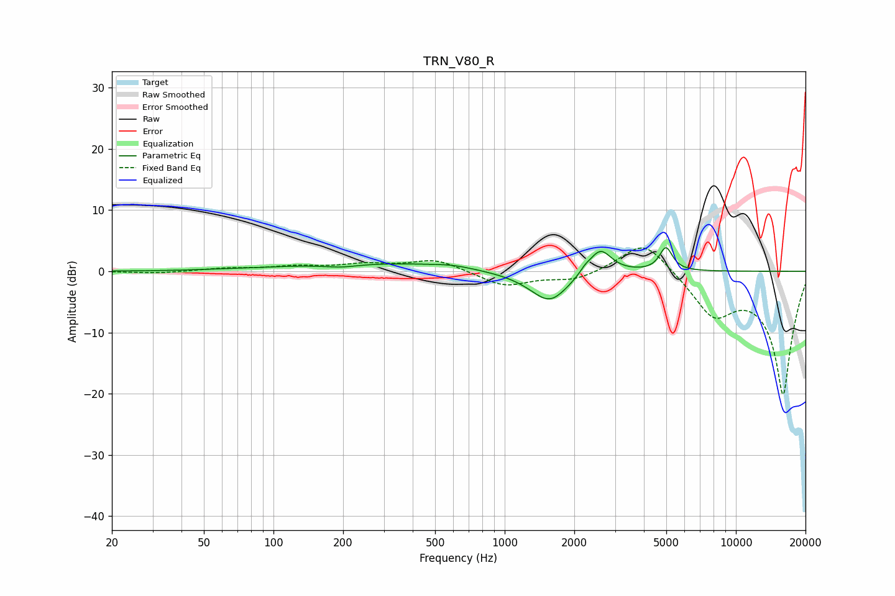

# TRN_V80_R
See [usage instructions](https://github.com/jaakkopasanen/AutoEq#usage) for more options and info.

### Parametric EQs
Apply preamp of -3.9 dB when using parametric equalizer.

|   # | Type    |   Fc (Hz) |    Q |   Gain (dB) |
|-----|---------|-----------|------|-------------|
|   1 | Peaking |        61 | 1.06 |         0.2 |
|   2 | Peaking |       121 | 0.88 |         0.4 |
|   3 | Peaking |       195 | 2.06 |        -0.4 |
|   4 | Peaking |       339 | 0.53 |         1.2 |
|   5 | Peaking |       597 | 1.68 |         0.4 |
|   6 | Peaking |      1370 | 1.13 |        -0.7 |
|   7 | Peaking |      1572 | 1.8  |        -4.5 |
|   8 | Peaking |      2231 | 5.98 |         0.7 |
|   9 | Peaking |      2590 | 2.93 |         4.1 |
|  10 | Peaking |      4984 | 5.08 |         3.8 |

### Fixed Band EQs
When using fixed band (also called graphic) equalizer, apply preamp of **-3.9 dB** (if available) and set gains manually with these parameters.

|   # | Type    |   Fc (Hz) |    Q |   Gain (dB) |
|-----|---------|-----------|------|-------------|
|   1 | Peaking |        31 | 1.41 |        -0.3 |
|   2 | Peaking |        62 | 1.41 |         0.4 |
|   3 | Peaking |       125 | 1.41 |         0.7 |
|   4 | Peaking |       250 | 1.41 |         1   |
|   5 | Peaking |       500 | 1.41 |         1.9 |
|   6 | Peaking |      1000 | 1.41 |        -2.4 |
|   7 | Peaking |      2000 | 1.41 |        -1.5 |
|   8 | Peaking |      4000 | 1.41 |         5.5 |
|   9 | Peaking |      8000 | 1.41 |        -6.5 |
|  10 | Peaking |     16000 | 1.41 |       -20   |

### Graphs

