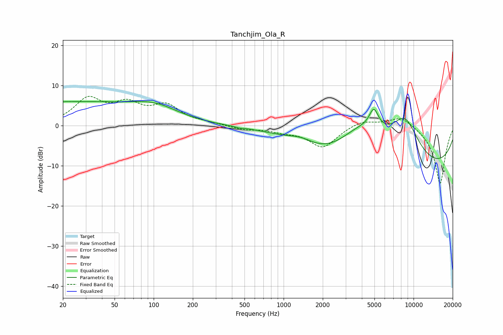

# Tanchjim_Ola_R
See [usage instructions](https://github.com/jaakkopasanen/AutoEq#usage) for more options and info.

### Parametric EQs
Apply preamp of -6.1 dB when using parametric equalizer.

|   # | Type    |   Fc (Hz) |    Q |   Gain (dB) |
|-----|---------|-----------|------|-------------|
|   1 | Peaking |        20 | 0.22 |         5.8 |
|   2 | Peaking |        41 | 3.82 |         0.1 |
|   3 | Peaking |       103 | 0.77 |         3.1 |
|   4 | Peaking |       455 | 5.89 |        -0.2 |
|   5 | Peaking |      1358 | 1.48 |         1.5 |
|   6 | Peaking |      2264 | 0.63 |        -4.7 |
|   7 | Peaking |      3815 | 0.61 |        10.7 |
|   8 | Peaking |      4943 | 3.86 |         5   |
|   9 | Peaking |      8601 | 1.11 |        10.7 |
|  10 | Peaking |      8706 | 0.18 |       -12.7 |

### Fixed Band EQs
When using fixed band (also called graphic) equalizer, apply preamp of **-7.4 dB** (if available) and set gains manually with these parameters.

|   # | Type    |   Fc (Hz) |    Q |   Gain (dB) |
|-----|---------|-----------|------|-------------|
|   1 | Peaking |        31 | 1.41 |         6.3 |
|   2 | Peaking |        62 | 1.41 |         4.5 |
|   3 | Peaking |       125 | 1.41 |         4.5 |
|   4 | Peaking |       250 | 1.41 |         0.5 |
|   5 | Peaking |       500 | 1.41 |        -0.9 |
|   6 | Peaking |      1000 | 1.41 |        -1.1 |
|   7 | Peaking |      2000 | 1.41 |        -5.3 |
|   8 | Peaking |      4000 | 1.41 |         1.5 |
|   9 | Peaking |      8000 | 1.41 |         2.6 |
|  10 | Peaking |     16000 | 1.41 |       -14.6 |

### Graphs

