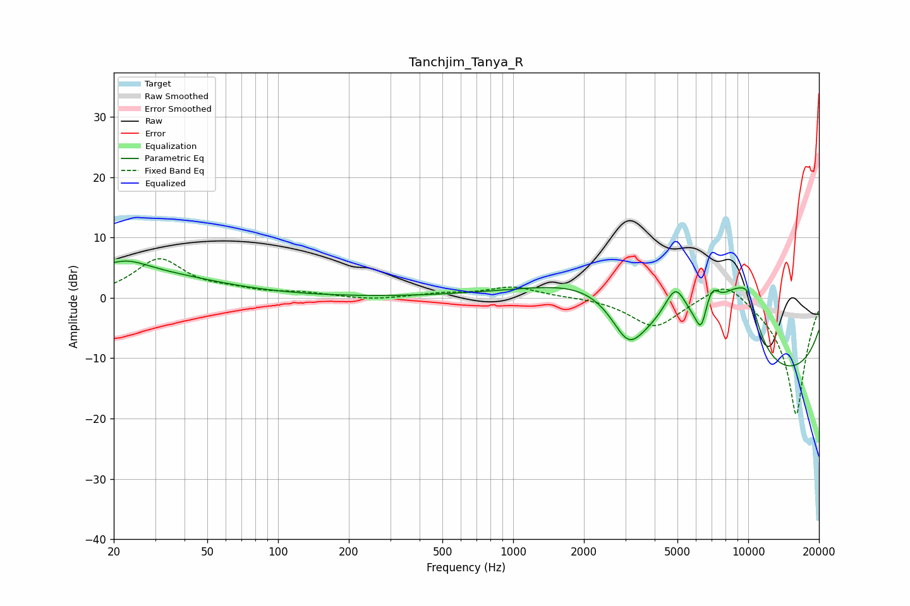

# Tanchjim_Tanya_R
See [usage instructions](https://github.com/jaakkopasanen/AutoEq#usage) for more options and info.

### Parametric EQs
Apply preamp of -6.2 dB when using parametric equalizer.

|   # | Type    |   Fc (Hz) |    Q |   Gain (dB) |
|-----|---------|-----------|------|-------------|
|   1 | Peaking |        20 | 0.38 |         4.7 |
|   2 | Peaking |        23 | 1.76 |         1.4 |
|   3 | Peaking |      2317 | 0.49 |         9.7 |
|   4 | Peaking |      3093 | 1.92 |        -7   |
|   5 | Peaking |      4910 | 2.64 |         7.3 |
|   6 | Peaking |      6308 | 6    |        -4   |
|   7 | Peaking |      6992 | 3.78 |         5   |
|   8 | Peaking |      8688 | 1.27 |        11.1 |
|   9 | Peaking |      9635 | 0.18 |       -15.6 |
|  10 | Peaking |     10000 | 2.8  |         5.7 |

### Fixed Band EQs
When using fixed band (also called graphic) equalizer, apply preamp of **-6.6 dB** (if available) and set gains manually with these parameters.

|   # | Type    |   Fc (Hz) |    Q |   Gain (dB) |
|-----|---------|-----------|------|-------------|
|   1 | Peaking |        31 | 1.41 |         6.3 |
|   2 | Peaking |        62 | 1.41 |         0.9 |
|   3 | Peaking |       125 | 1.41 |         0.7 |
|   4 | Peaking |       250 | 1.41 |        -0.4 |
|   5 | Peaking |       500 | 1.41 |         0.6 |
|   6 | Peaking |      1000 | 1.41 |         1.8 |
|   7 | Peaking |      2000 | 1.41 |         0.1 |
|   8 | Peaking |      4000 | 1.41 |        -4.9 |
|   9 | Peaking |      8000 | 1.41 |         3.9 |
|  10 | Peaking |     16000 | 1.41 |       -19.6 |

### Graphs

