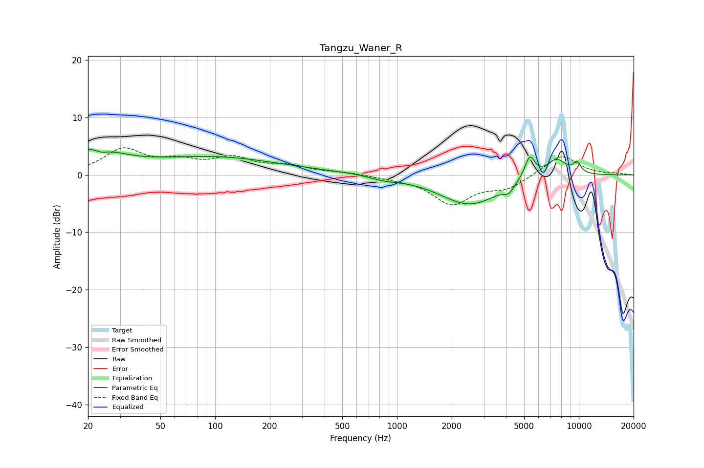

# Tangzu_Waner_R
See [usage instructions](https://github.com/jaakkopasanen/AutoEq#usage) for more options and info.

### Parametric EQs
Apply preamp of -4.6 dB when using parametric equalizer.

|   # | Type    |   Fc (Hz) |    Q |   Gain (dB) |
|-----|---------|-----------|------|-------------|
|   1 | Peaking |        21 | 0.92 |         4.2 |
|   2 | Peaking |        24 | 3.73 |        -0.8 |
|   3 | Peaking |        99 | 0.41 |         2.9 |
|   4 | Peaking |       857 | 1.61 |        -0.7 |
|   5 | Peaking |      1370 | 0.18 |         0.5 |
|   6 | Peaking |      2506 | 0.81 |        -5.5 |
|   7 | Peaking |      4122 | 5.15 |        -1.2 |
|   8 | Peaking |      5369 | 4.66 |         4.1 |
|   9 | Peaking |      7521 | 2.42 |         3   |
|  10 | Peaking |      9772 | 5.83 |         1.8 |

### Fixed Band EQs
When using fixed band (also called graphic) equalizer, apply preamp of **-4.8 dB** (if available) and set gains manually with these parameters.

|   # | Type    |   Fc (Hz) |    Q |   Gain (dB) |
|-----|---------|-----------|------|-------------|
|   1 | Peaking |        31 | 1.41 |         4.3 |
|   2 | Peaking |        62 | 1.41 |         1.9 |
|   3 | Peaking |       125 | 1.41 |         2.6 |
|   4 | Peaking |       250 | 1.41 |         1.4 |
|   5 | Peaking |       500 | 1.41 |         0.4 |
|   6 | Peaking |      1000 | 1.41 |        -0.4 |
|   7 | Peaking |      2000 | 1.41 |        -4.9 |
|   8 | Peaking |      4000 | 1.41 |        -2.1 |
|   9 | Peaking |      8000 | 1.41 |         3.6 |
|  10 | Peaking |     16000 | 1.41 |         0.2 |

### Graphs

