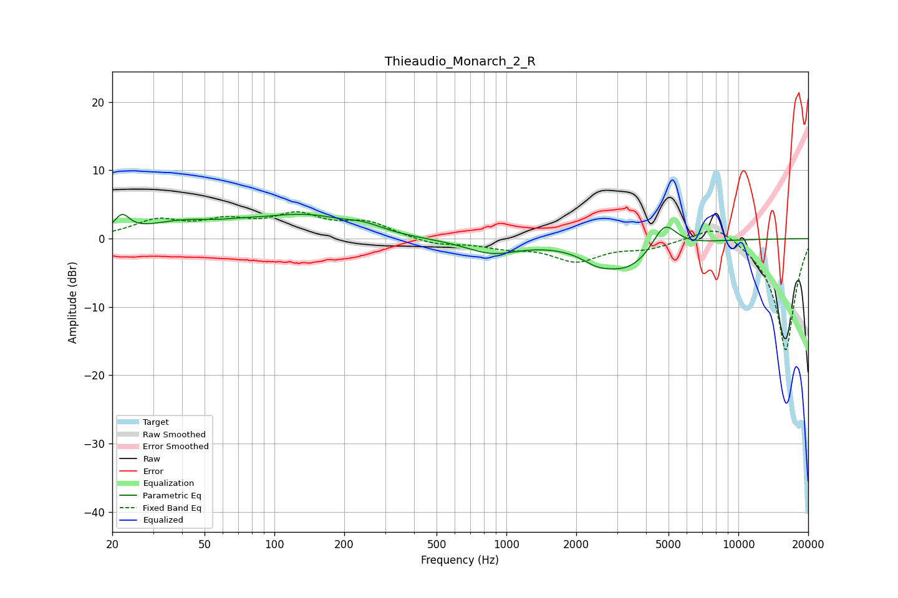

# Thieaudio_Monarch_2_R
See [usage instructions](https://github.com/jaakkopasanen/AutoEq#usage) for more options and info.

### Parametric EQs
Apply preamp of -3.7 dB when using parametric equalizer.

|   # | Type    |   Fc (Hz) |    Q |   Gain (dB) |
|-----|---------|-----------|------|-------------|
|   1 | Peaking |        22 | 4.44 |         2.5 |
|   2 | Peaking |        40 | 0.88 |         2.1 |
|   3 | Peaking |        72 | 1.54 |         0.6 |
|   4 | Peaking |       126 | 1.84 |        -0.6 |
|   5 | Peaking |       129 | 0.95 |         3.6 |
|   6 | Peaking |       241 | 1.57 |         1.2 |
|   7 | Peaking |       867 | 1.23 |        -2   |
|   8 | Peaking |      2439 | 2.33 |        -1.1 |
|   9 | Peaking |      3320 | 1.08 |        -4.5 |
|  10 | Peaking |      4798 | 2.64 |         4.3 |

### Fixed Band EQs
When using fixed band (also called graphic) equalizer, apply preamp of **-4.0 dB** (if available) and set gains manually with these parameters.

|   # | Type    |   Fc (Hz) |    Q |   Gain (dB) |
|-----|---------|-----------|------|-------------|
|   1 | Peaking |        31 | 1.41 |         2.5 |
|   2 | Peaking |        62 | 1.41 |         2.2 |
|   3 | Peaking |       125 | 1.41 |         3.1 |
|   4 | Peaking |       250 | 1.41 |         2.2 |
|   5 | Peaking |       500 | 1.41 |        -0.9 |
|   6 | Peaking |      1000 | 1.41 |        -1.1 |
|   7 | Peaking |      2000 | 1.41 |        -3.1 |
|   8 | Peaking |      4000 | 1.41 |        -1.2 |
|   9 | Peaking |      8000 | 1.41 |         2.6 |
|  10 | Peaking |     16000 | 1.41 |       -16.5 |

### Graphs

