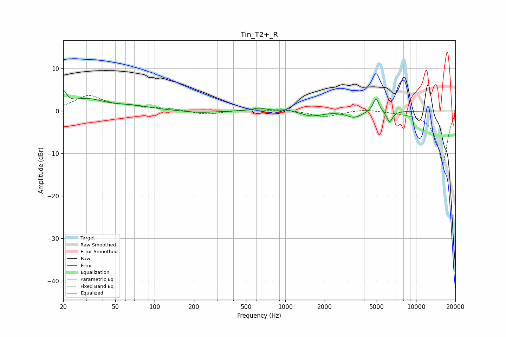

# Tin_T2+_R
See [usage instructions](https://github.com/jaakkopasanen/AutoEq#usage) for more options and info.

### Parametric EQs
Apply preamp of -4.9 dB when using parametric equalizer.

|   # | Type    |   Fc (Hz) |    Q |   Gain (dB) |
|-----|---------|-----------|------|-------------|
|   1 | Peaking |        20 | 5.99 |         3.2 |
|   2 | Peaking |        30 | 1.02 |         2.7 |
|   3 | Peaking |        69 | 1.06 |         0.9 |
|   4 | Peaking |       222 | 1.28 |        -0.4 |
|   5 | Peaking |       628 | 2.79 |         0.7 |
|   6 | Peaking |      1012 | 2.71 |         0.5 |
|   7 | Peaking |      1598 | 1.89 |        -1.2 |
|   8 | Peaking |      3368 | 2.49 |        -1.5 |
|   9 | Peaking |      4946 | 5.89 |         3.3 |
|  10 | Peaking |      6274 | 6    |        -2.7 |

### Fixed Band EQs
When using fixed band (also called graphic) equalizer, apply preamp of **-3.8 dB** (if available) and set gains manually with these parameters.

|   # | Type    |   Fc (Hz) |    Q |   Gain (dB) |
|-----|---------|-----------|------|-------------|
|   1 | Peaking |        31 | 1.41 |         3.5 |
|   2 | Peaking |        62 | 1.41 |         0.9 |
|   3 | Peaking |       125 | 1.41 |         0.5 |
|   4 | Peaking |       250 | 1.41 |        -0.9 |
|   5 | Peaking |       500 | 1.41 |         0.4 |
|   6 | Peaking |      1000 | 1.41 |         0.3 |
|   7 | Peaking |      2000 | 1.41 |        -1.4 |
|   8 | Peaking |      4000 | 1.41 |         0.5 |
|   9 | Peaking |      8000 | 1.41 |        -0.2 |
|  10 | Peaking |     16000 | 1.41 |       -12.3 |

### Graphs

