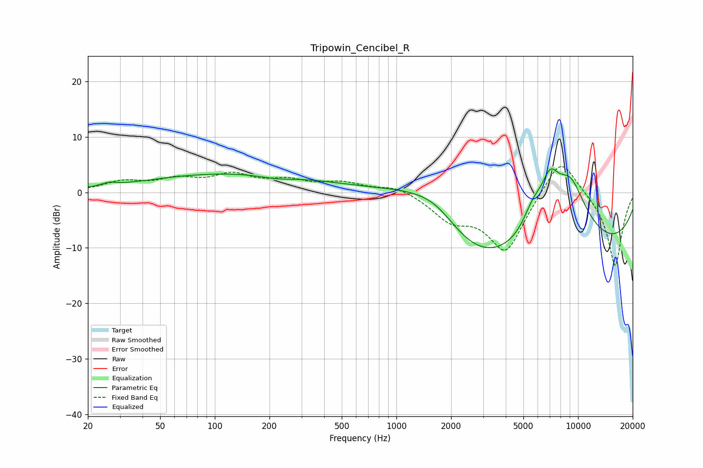

# Tripowin_Cencibel_R
See [usage instructions](https://github.com/jaakkopasanen/AutoEq#usage) for more options and info.

### Parametric EQs
Apply preamp of -4.3 dB when using parametric equalizer.

|   # | Type    |   Fc (Hz) |    Q |   Gain (dB) |
|-----|---------|-----------|------|-------------|
|   1 | Peaking |        26 | 3.5  |         0.6 |
|   2 | Peaking |       131 | 0.28 |         3.5 |
|   3 | Peaking |       219 | 1.38 |        -0.7 |
|   4 | Peaking |      1328 | 0.7  |         3.6 |
|   5 | Peaking |      1687 | 1.24 |         2.3 |
|   6 | Peaking |      2688 | 0.58 |        -7.2 |
|   7 | Peaking |      5641 | 2.4  |         4.3 |
|   8 | Peaking |      7014 | 2.57 |         7   |
|   9 | Peaking |      9027 | 1.1  |        12.9 |
|  10 | Peaking |     10000 | 0.22 |       -11.5 |

### Fixed Band EQs
When using fixed band (also called graphic) equalizer, apply preamp of **-4.7 dB** (if available) and set gains manually with these parameters.

|   # | Type    |   Fc (Hz) |    Q |   Gain (dB) |
|-----|---------|-----------|------|-------------|
|   1 | Peaking |        31 | 1.41 |         1.8 |
|   2 | Peaking |        62 | 1.41 |         2   |
|   3 | Peaking |       125 | 1.41 |         2.8 |
|   4 | Peaking |       250 | 1.41 |         1.8 |
|   5 | Peaking |       500 | 1.41 |         1.6 |
|   6 | Peaking |      1000 | 1.41 |         1.3 |
|   7 | Peaking |      2000 | 1.41 |        -4.2 |
|   8 | Peaking |      4000 | 1.41 |       -10.6 |
|   9 | Peaking |      8000 | 1.41 |         7.4 |
|  10 | Peaking |     16000 | 1.41 |       -13.5 |

### Graphs

