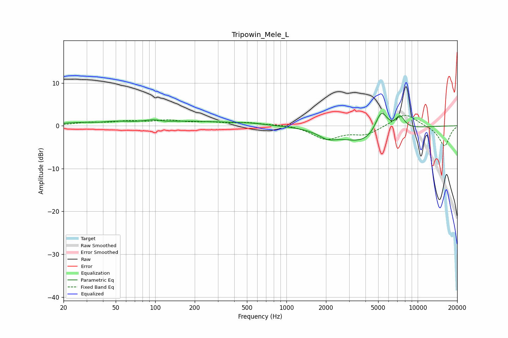

# Tripowin_Mele_L
See [usage instructions](https://github.com/jaakkopasanen/AutoEq#usage) for more options and info.

### Parametric EQs
Apply preamp of -3.0 dB when using parametric equalizer.

|   # | Type    |   Fc (Hz) |    Q |   Gain (dB) |
|-----|---------|-----------|------|-------------|
|   1 | Peaking |        25 | 1.06 |         0.6 |
|   2 | Peaking |        51 | 1.4  |         0.6 |
|   3 | Peaking |       105 | 1.72 |         1.5 |
|   4 | Peaking |       113 | 2.18 |        -1   |
|   5 | Peaking |       204 | 0.51 |         0.9 |
|   6 | Peaking |       529 | 1.16 |         0.4 |
|   7 | Peaking |      2061 | 1.97 |        -1.7 |
|   8 | Peaking |      3993 | 0.81 |        -4.1 |
|   9 | Peaking |      5279 | 2.78 |         5.9 |
|  10 | Peaking |      7337 | 3.79 |         3   |

### Fixed Band EQs
When using fixed band (also called graphic) equalizer, apply preamp of **-2.5 dB** (if available) and set gains manually with these parameters.

|   # | Type    |   Fc (Hz) |    Q |   Gain (dB) |
|-----|---------|-----------|------|-------------|
|   1 | Peaking |        31 | 1.41 |         0.7 |
|   2 | Peaking |        62 | 1.41 |         0.9 |
|   3 | Peaking |       125 | 1.41 |         1.1 |
|   4 | Peaking |       250 | 1.41 |         0.7 |
|   5 | Peaking |       500 | 1.41 |         0.6 |
|   6 | Peaking |      1000 | 1.41 |         0.4 |
|   7 | Peaking |      2000 | 1.41 |        -3   |
|   8 | Peaking |      4000 | 1.41 |        -1.9 |
|   9 | Peaking |      8000 | 1.41 |         3   |
|  10 | Peaking |     16000 | 1.41 |        -4.8 |

### Graphs

