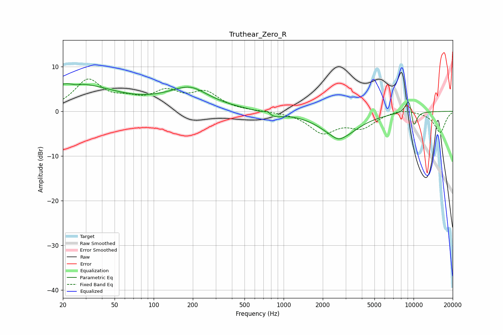

# Truthear_Zero_R
See [usage instructions](https://github.com/jaakkopasanen/AutoEq#usage) for more options and info.

### Parametric EQs
Apply preamp of -6.2 dB when using parametric equalizer.

|   # | Type    |   Fc (Hz) |    Q |   Gain (dB) |
|-----|---------|-----------|------|-------------|
|   1 | Peaking |        23 | 0.43 |         6.2 |
|   2 | Peaking |        25 | 4.76 |        -0.3 |
|   3 | Peaking |       179 | 0.7  |         3.7 |
|   4 | Peaking |       195 | 1.44 |         1.3 |
|   5 | Peaking |       746 | 5.96 |         0.9 |
|   6 | Peaking |       823 | 2.25 |        -1.2 |
|   7 | Peaking |      2631 | 3.85 |        -0.5 |
|   8 | Peaking |      2700 | 1.02 |        -5.7 |
|   9 | Peaking |      9249 | 4.48 |         4.3 |
|  10 | Peaking |     10000 | 5.11 |        -4.7 |

### Fixed Band EQs
When using fixed band (also called graphic) equalizer, apply preamp of **-7.3 dB** (if available) and set gains manually with these parameters.

|   # | Type    |   Fc (Hz) |    Q |   Gain (dB) |
|-----|---------|-----------|------|-------------|
|   1 | Peaking |        31 | 1.41 |         6.7 |
|   2 | Peaking |        62 | 1.41 |         1.9 |
|   3 | Peaking |       125 | 1.41 |         3.8 |
|   4 | Peaking |       250 | 1.41 |         3.9 |
|   5 | Peaking |       500 | 1.41 |         0   |
|   6 | Peaking |      1000 | 1.41 |        -0   |
|   7 | Peaking |      2000 | 1.41 |        -4.5 |
|   8 | Peaking |      4000 | 1.41 |        -3.3 |
|   9 | Peaking |      8000 | 1.41 |         0.8 |
|  10 | Peaking |     16000 | 1.41 |        -4.7 |

### Graphs

