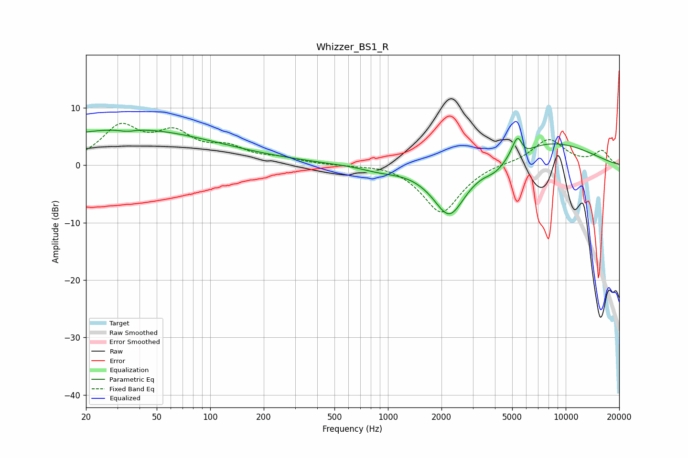

# Whizzer_BS1_R
See [usage instructions](https://github.com/jaakkopasanen/AutoEq#usage) for more options and info.

### Parametric EQs
Apply preamp of -6.2 dB when using parametric equalizer.

|   # | Type    |   Fc (Hz) |    Q |   Gain (dB) |
|-----|---------|-----------|------|-------------|
|   1 | Peaking |        27 | 0.27 |         5.5 |
|   2 | Peaking |        34 | 5.77 |         3.2 |
|   3 | Peaking |        34 | 5.45 |        -3.6 |
|   4 | Peaking |        91 | 0.3  |         1.3 |
|   5 | Peaking |       898 | 1.34 |        -0.7 |
|   6 | Peaking |      2218 | 1.47 |        -9.3 |
|   7 | Peaking |      4033 | 2.17 |        -1.8 |
|   8 | Peaking |      5373 | 4.47 |         4.3 |
|   9 | Peaking |      5734 | 3.09 |        -1.8 |
|  10 | Peaking |      7817 | 0.48 |         4.2 |

### Fixed Band EQs
When using fixed band (also called graphic) equalizer, apply preamp of **-7.4 dB** (if available) and set gains manually with these parameters.

|   # | Type    |   Fc (Hz) |    Q |   Gain (dB) |
|-----|---------|-----------|------|-------------|
|   1 | Peaking |        31 | 1.41 |         6.3 |
|   2 | Peaking |        62 | 1.41 |         4.8 |
|   3 | Peaking |       125 | 1.41 |         2.5 |
|   4 | Peaking |       250 | 1.41 |         1   |
|   5 | Peaking |       500 | 1.41 |        -0   |
|   6 | Peaking |      1000 | 1.41 |         0.4 |
|   7 | Peaking |      2000 | 1.41 |        -8.4 |
|   8 | Peaking |      4000 | 1.41 |         0.4 |
|   9 | Peaking |      8000 | 1.41 |         4.5 |
|  10 | Peaking |     16000 | 1.41 |         2.4 |

### Graphs

