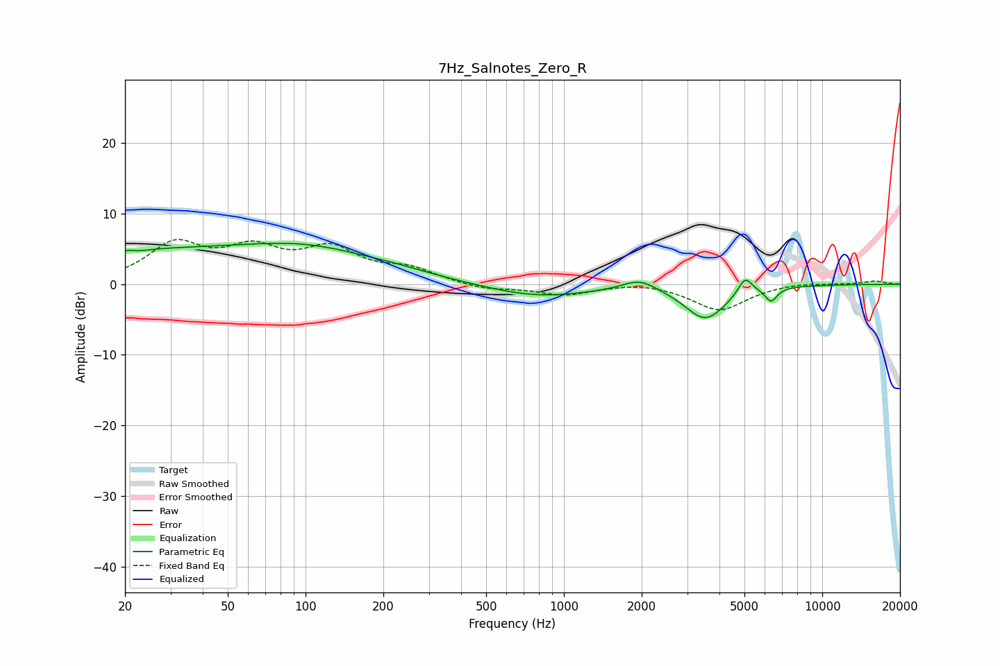

# 7Hz_Salnotes_Zero_R
See [usage instructions](https://github.com/jaakkopasanen/AutoEq#usage) for more options and info.

### Parametric EQs
Apply preamp of -5.9 dB when using parametric equalizer.

|   # | Type    |   Fc (Hz) |    Q |   Gain (dB) |
|-----|---------|-----------|------|-------------|
|   1 | Peaking |        20 | 5.99 |         0.6 |
|   2 | Peaking |        23 | 0.81 |         1.7 |
|   3 | Peaking |        71 | 0.3  |         4.6 |
|   4 | Peaking |       102 | 0.71 |         1.1 |
|   5 | Peaking |       225 | 1.6  |         0.2 |
|   6 | Peaking |       780 | 0.67 |        -1.9 |
|   7 | Peaking |      1966 | 2.12 |         1.6 |
|   8 | Peaking |      3529 | 1.74 |        -4.9 |
|   9 | Peaking |      5027 | 5.04 |         2.5 |
|  10 | Peaking |      6337 | 6    |        -1.9 |

### Fixed Band EQs
When using fixed band (also called graphic) equalizer, apply preamp of **-6.4 dB** (if available) and set gains manually with these parameters.

|   # | Type    |   Fc (Hz) |    Q |   Gain (dB) |
|-----|---------|-----------|------|-------------|
|   1 | Peaking |        31 | 1.41 |         5.3 |
|   2 | Peaking |        62 | 1.41 |         4.2 |
|   3 | Peaking |       125 | 1.41 |         4.5 |
|   4 | Peaking |       250 | 1.41 |         1.9 |
|   5 | Peaking |       500 | 1.41 |        -0.8 |
|   6 | Peaking |      1000 | 1.41 |        -1.4 |
|   7 | Peaking |      2000 | 1.41 |         0.4 |
|   8 | Peaking |      4000 | 1.41 |        -3.7 |
|   9 | Peaking |      8000 | 1.41 |         0.3 |
|  10 | Peaking |     16000 | 1.41 |         0.5 |

### Graphs

