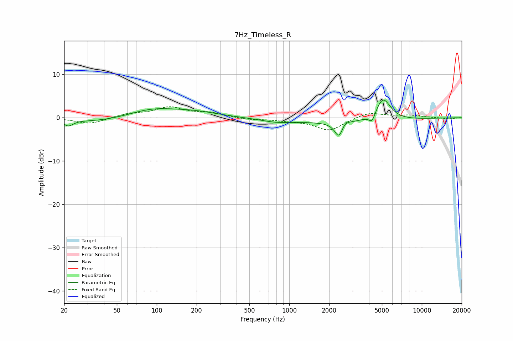

# 7Hz_Timeless_R
See [usage instructions](https://github.com/jaakkopasanen/AutoEq#usage) for more options and info.

### Parametric EQs
Apply preamp of -4.2 dB when using parametric equalizer.

|   # | Type    |   Fc (Hz) |    Q |   Gain (dB) |
|-----|---------|-----------|------|-------------|
|   1 | Peaking |        22 | 3.9  |        -1.4 |
|   2 | Peaking |        36 | 0.68 |        -0.9 |
|   3 | Peaking |        92 | 0.83 |         1.8 |
|   4 | Peaking |       190 | 0.76 |         1.2 |
|   5 | Peaking |       787 | 1.34 |        -0.6 |
|   6 | Peaking |      2382 | 4.33 |        -4.1 |
|   7 | Peaking |      2583 | 4.15 |         1.6 |
|   8 | Peaking |      2606 | 0.33 |        -1.2 |
|   9 | Peaking |      4215 | 6    |        -2.1 |
|  10 | Peaking |      5098 | 2.46 |         5.3 |

### Fixed Band EQs
When using fixed band (also called graphic) equalizer, apply preamp of **-2.6 dB** (if available) and set gains manually with these parameters.

|   # | Type    |   Fc (Hz) |    Q |   Gain (dB) |
|-----|---------|-----------|------|-------------|
|   1 | Peaking |        31 | 1.41 |        -1.5 |
|   2 | Peaking |        62 | 1.41 |         0.9 |
|   3 | Peaking |       125 | 1.41 |         2.3 |
|   4 | Peaking |       250 | 1.41 |         1   |
|   5 | Peaking |       500 | 1.41 |        -0.4 |
|   6 | Peaking |      1000 | 1.41 |        -0.5 |
|   7 | Peaking |      2000 | 1.41 |        -2.9 |
|   8 | Peaking |      4000 | 1.41 |         1.3 |
|   9 | Peaking |      8000 | 1.41 |         0.5 |
|  10 | Peaking |     16000 | 1.41 |        -0.3 |

### Graphs

