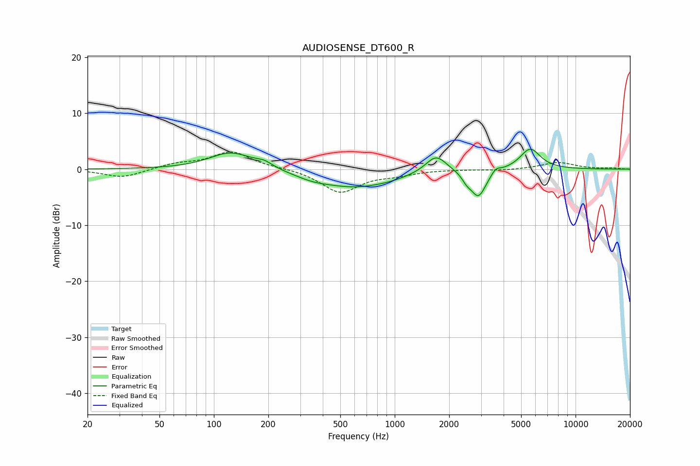

# AUDIOSENSE_DT600_R
See [usage instructions](https://github.com/jaakkopasanen/AutoEq#usage) for more options and info.

### Parametric EQs
Apply preamp of -3.7 dB when using parametric equalizer.

|   # | Type    |   Fc (Hz) |    Q |   Gain (dB) |
|-----|---------|-----------|------|-------------|
|   1 | Peaking |       125 | 1.17 |         3.1 |
|   2 | Peaking |       190 | 3.15 |         0.8 |
|   3 | Peaking |       349 | 1.43 |        -0.9 |
|   4 | Peaking |       598 | 0.74 |        -2.9 |
|   5 | Peaking |       959 | 1.32 |        -0.5 |
|   6 | Peaking |      1695 | 2.48 |         3.1 |
|   7 | Peaking |      2500 | 5.6  |        -1.1 |
|   8 | Peaking |      2903 | 3.31 |        -4.9 |
|   9 | Peaking |      3624 | 5.81 |         0.9 |
|  10 | Peaking |      5614 | 2.49 |         3.7 |

### Fixed Band EQs
When using fixed band (also called graphic) equalizer, apply preamp of **-3.2 dB** (if available) and set gains manually with these parameters.

|   # | Type    |   Fc (Hz) |    Q |   Gain (dB) |
|-----|---------|-----------|------|-------------|
|   1 | Peaking |        31 | 1.41 |        -1.5 |
|   2 | Peaking |        62 | 1.41 |         0.9 |
|   3 | Peaking |       125 | 1.41 |         3.1 |
|   4 | Peaking |       250 | 1.41 |         0.2 |
|   5 | Peaking |       500 | 1.41 |        -4.1 |
|   6 | Peaking |      1000 | 1.41 |        -0.8 |
|   7 | Peaking |      2000 | 1.41 |        -0   |
|   8 | Peaking |      4000 | 1.41 |        -0.2 |
|   9 | Peaking |      8000 | 1.41 |         1.2 |
|  10 | Peaking |     16000 | 1.41 |         0.2 |

### Graphs

