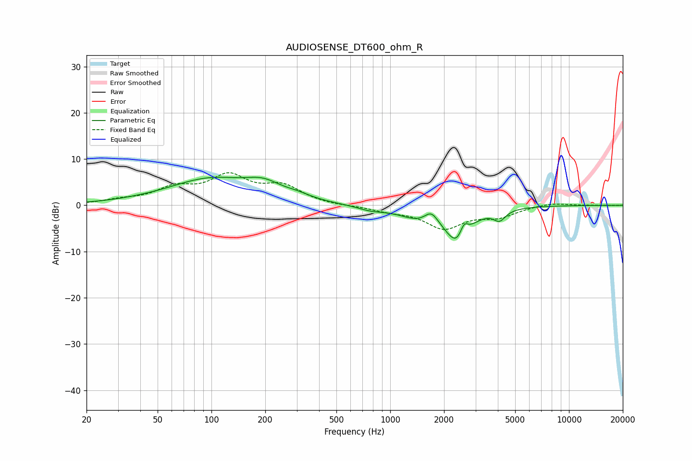

# AUDIOSENSE_DT600_ohm_R
See [usage instructions](https://github.com/jaakkopasanen/AutoEq#usage) for more options and info.

### Parametric EQs
Apply preamp of -6.2 dB when using parametric equalizer.

|   # | Type    |   Fc (Hz) |    Q |   Gain (dB) |
|-----|---------|-----------|------|-------------|
|   1 | Peaking |        76 | 0.73 |        -0.7 |
|   2 | Peaking |        95 | 0.59 |         6.1 |
|   3 | Peaking |       195 | 1.43 |         2.7 |
|   4 | Peaking |       304 | 1.91 |         0.8 |
|   5 | Peaking |       776 | 1.84 |        -0.8 |
|   6 | Peaking |      1467 | 1.26 |        -2.5 |
|   7 | Peaking |      1697 | 3.69 |         2.7 |
|   8 | Peaking |      2379 | 2.09 |        -7.6 |
|   9 | Peaking |      2584 | 6    |         3.1 |
|  10 | Peaking |      4089 | 4.22 |        -2.2 |

### Fixed Band EQs
When using fixed band (also called graphic) equalizer, apply preamp of **-7.1 dB** (if available) and set gains manually with these parameters.

|   # | Type    |   Fc (Hz) |    Q |   Gain (dB) |
|-----|---------|-----------|------|-------------|
|   1 | Peaking |        31 | 1.41 |         0.9 |
|   2 | Peaking |        62 | 1.41 |         3.2 |
|   3 | Peaking |       125 | 1.41 |         5.8 |
|   4 | Peaking |       250 | 1.41 |         3.7 |
|   5 | Peaking |       500 | 1.41 |        -0.2 |
|   6 | Peaking |      1000 | 1.41 |        -1   |
|   7 | Peaking |      2000 | 1.41 |        -4.7 |
|   8 | Peaking |      4000 | 1.41 |        -2.2 |
|   9 | Peaking |      8000 | 1.41 |         0.6 |
|  10 | Peaking |     16000 | 1.41 |        -0   |

### Graphs

