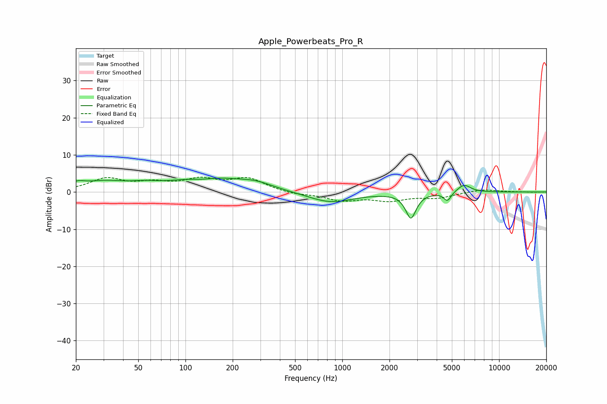

# Apple_Powerbeats_Pro_R
See [usage instructions](https://github.com/jaakkopasanen/AutoEq#usage) for more options and info.

### Parametric EQs
Apply preamp of -3.8 dB when using parametric equalizer.

|   # | Type    |   Fc (Hz) |    Q |   Gain (dB) |
|-----|---------|-----------|------|-------------|
|   1 | Peaking |        20 | 3.27 |         1.2 |
|   2 | Peaking |        30 | 0.93 |         2.4 |
|   3 | Peaking |        55 | 1.67 |         0.8 |
|   4 | Peaking |       130 | 1.93 |        -0.7 |
|   5 | Peaking |       139 | 0.63 |         3.8 |
|   6 | Peaking |       283 | 1.32 |         1.4 |
|   7 | Peaking |       842 | 0.98 |        -2.9 |
|   8 | Peaking |      2738 | 4.26 |        -6.8 |
|   9 | Peaking |      4684 | 6    |        -2.4 |
|  10 | Peaking |      5975 | 3.28 |         2.1 |

### Fixed Band EQs
When using fixed band (also called graphic) equalizer, apply preamp of **-4.1 dB** (if available) and set gains manually with these parameters.

|   # | Type    |   Fc (Hz) |    Q |   Gain (dB) |
|-----|---------|-----------|------|-------------|
|   1 | Peaking |        31 | 1.41 |         3.4 |
|   2 | Peaking |        62 | 1.41 |         2   |
|   3 | Peaking |       125 | 1.41 |         2.9 |
|   4 | Peaking |       250 | 1.41 |         3.4 |
|   5 | Peaking |       500 | 1.41 |        -0.6 |
|   6 | Peaking |      1000 | 1.41 |        -2.1 |
|   7 | Peaking |      2000 | 1.41 |        -2   |
|   8 | Peaking |      4000 | 1.41 |        -1.4 |
|   9 | Peaking |      8000 | 1.41 |         0.8 |
|  10 | Peaking |     16000 | 1.41 |        -0.1 |

### Graphs

