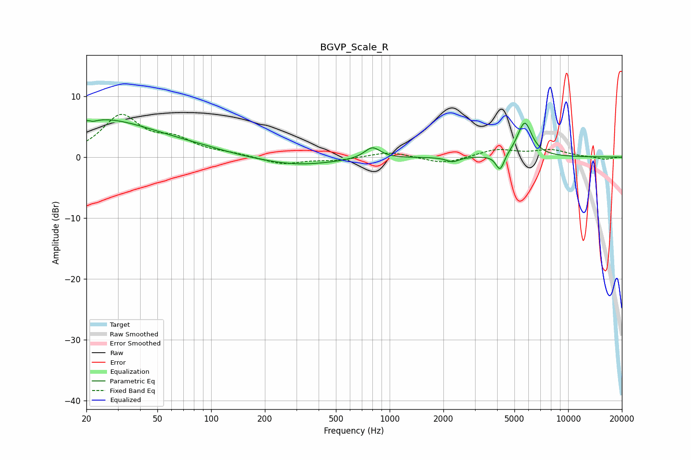

# BGVP_Scale_R
See [usage instructions](https://github.com/jaakkopasanen/AutoEq#usage) for more options and info.

### Parametric EQs
Apply preamp of -6.2 dB when using parametric equalizer.

|   # | Type    |   Fc (Hz) |    Q |   Gain (dB) |
|-----|---------|-----------|------|-------------|
|   1 | Peaking |        21 | 5.93 |         3.2 |
|   2 | Peaking |        21 | 5.88 |        -3.4 |
|   3 | Peaking |        22 | 0.31 |         4.9 |
|   4 | Peaking |        26 | 0.74 |         1.3 |
|   5 | Peaking |        88 | 2.03 |         0.1 |
|   6 | Peaking |       297 | 0.63 |        -1.4 |
|   7 | Peaking |       800 | 3.18 |         1.9 |
|   8 | Peaking |      2249 | 4.01 |        -0.8 |
|   9 | Peaking |      4155 | 6    |        -2.8 |
|  10 | Peaking |      5707 | 3.39 |         5.7 |

### Fixed Band EQs
When using fixed band (also called graphic) equalizer, apply preamp of **-7.1 dB** (if available) and set gains manually with these parameters.

|   # | Type    |   Fc (Hz) |    Q |   Gain (dB) |
|-----|---------|-----------|------|-------------|
|   1 | Peaking |        31 | 1.41 |         6.6 |
|   2 | Peaking |        62 | 1.41 |         2.4 |
|   3 | Peaking |       125 | 1.41 |         0.4 |
|   4 | Peaking |       250 | 1.41 |        -1.2 |
|   5 | Peaking |       500 | 1.41 |        -0.5 |
|   6 | Peaking |      1000 | 1.41 |         0.9 |
|   7 | Peaking |      2000 | 1.41 |        -1.2 |
|   8 | Peaking |      4000 | 1.41 |         1.2 |
|   9 | Peaking |      8000 | 1.41 |         1.1 |
|  10 | Peaking |     16000 | 1.41 |        -0.4 |

### Graphs

