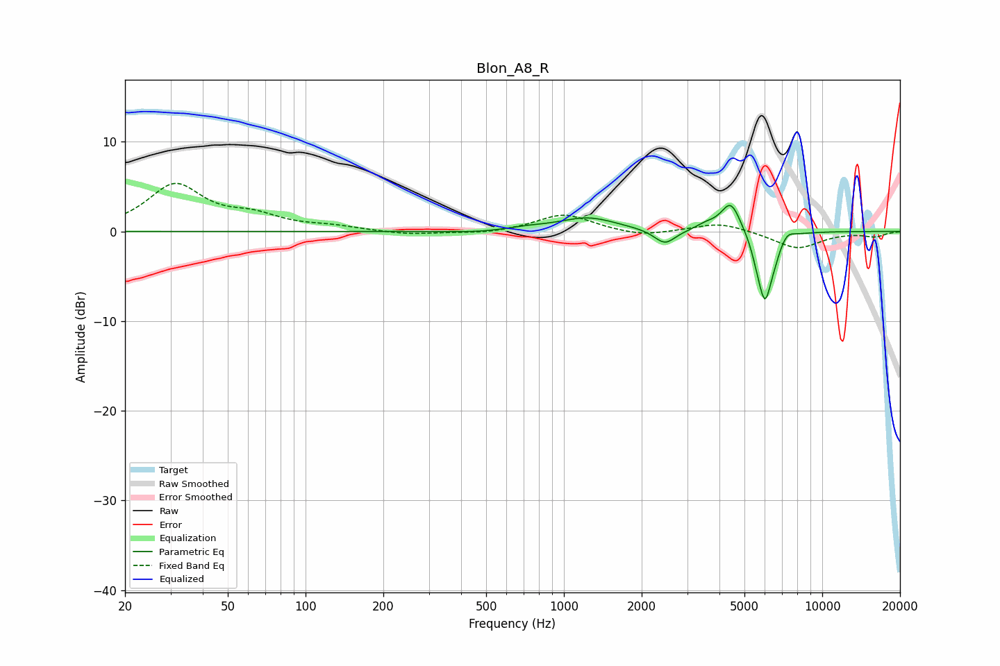

# Blon_A8_R
See [usage instructions](https://github.com/jaakkopasanen/AutoEq#usage) for more options and info.

### Parametric EQs
Apply preamp of -3.0 dB when using parametric equalizer.

|   # | Type    |   Fc (Hz) |    Q |   Gain (dB) |
|-----|---------|-----------|------|-------------|
|   1 | Peaking |       469 | 1.27 |        -0.2 |
|   2 | Peaking |       714 | 1.71 |         0.3 |
|   3 | Peaking |      1239 | 1.28 |         1.5 |
|   4 | Peaking |      2461 | 3.41 |        -1.7 |
|   5 | Peaking |      3549 | 3.49 |         0.6 |
|   6 | Peaking |      4426 | 3.71 |         3.4 |
|   7 | Peaking |      5604 | 6    |        -1.3 |
|   8 | Peaking |      6009 | 5.2  |        -7   |
|   9 | Peaking |      6545 | 6    |        -1.1 |
|  10 | Peaking |      7331 | 5.39 |         0.7 |

### Fixed Band EQs
When using fixed band (also called graphic) equalizer, apply preamp of **-5.5 dB** (if available) and set gains manually with these parameters.

|   # | Type    |   Fc (Hz) |    Q |   Gain (dB) |
|-----|---------|-----------|------|-------------|
|   1 | Peaking |        31 | 1.41 |         5.1 |
|   2 | Peaking |        62 | 1.41 |         1.4 |
|   3 | Peaking |       125 | 1.41 |         0.4 |
|   4 | Peaking |       250 | 1.41 |        -0.4 |
|   5 | Peaking |       500 | 1.41 |        -0.3 |
|   6 | Peaking |      1000 | 1.41 |         1.9 |
|   7 | Peaking |      2000 | 1.41 |        -0.6 |
|   8 | Peaking |      4000 | 1.41 |         1   |
|   9 | Peaking |      8000 | 1.41 |        -1.9 |
|  10 | Peaking |     16000 | 1.41 |        -0.5 |

### Graphs

