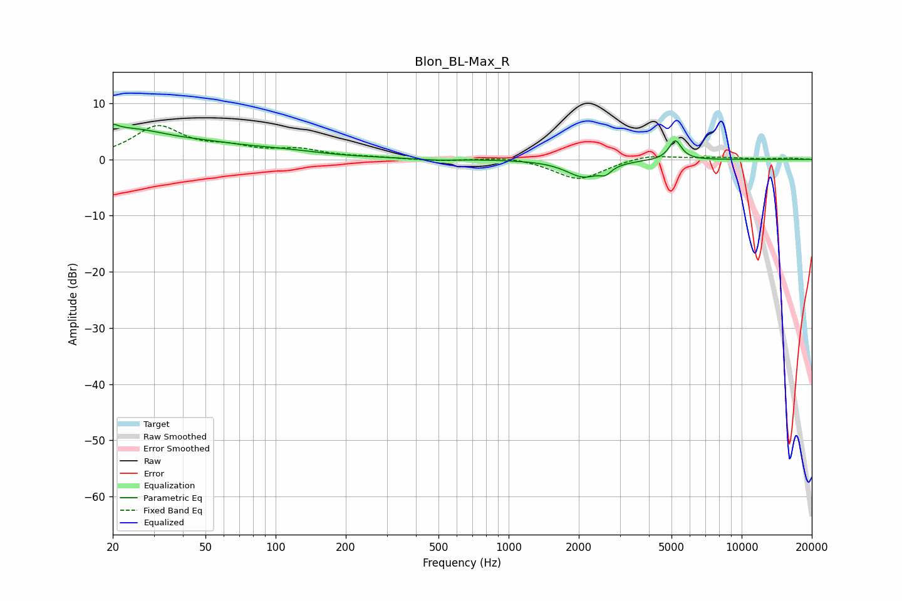

# Blon_BL-Max_R
See [usage instructions](https://github.com/jaakkopasanen/AutoEq#usage) for more options and info.

### Parametric EQs
Apply preamp of -6.3 dB when using parametric equalizer.

|   # | Type    |   Fc (Hz) |    Q |   Gain (dB) |
|-----|---------|-----------|------|-------------|
|   1 | Peaking |        20 | 6    |        -4.2 |
|   2 | Peaking |        20 | 6    |         5.3 |
|   3 | Peaking |        23 | 0.68 |         5   |
|   4 | Peaking |        51 | 1.42 |         0.4 |
|   5 | Peaking |        92 | 0.53 |         1.5 |
|   6 | Peaking |       185 | 1.1  |        -0.2 |
|   7 | Peaking |       491 | 1.86 |        -0.3 |
|   8 | Peaking |      2098 | 1.9  |        -3   |
|   9 | Peaking |      2607 | 5.99 |        -1.2 |
|  10 | Peaking |      5187 | 5.3  |         3.5 |

### Fixed Band EQs
When using fixed band (also called graphic) equalizer, apply preamp of **-6.1 dB** (if available) and set gains manually with these parameters.

|   # | Type    |   Fc (Hz) |    Q |   Gain (dB) |
|-----|---------|-----------|------|-------------|
|   1 | Peaking |        31 | 1.41 |         5.7 |
|   2 | Peaking |        62 | 1.41 |         1.6 |
|   3 | Peaking |       125 | 1.41 |         1.5 |
|   4 | Peaking |       250 | 1.41 |         0.3 |
|   5 | Peaking |       500 | 1.41 |        -0.3 |
|   6 | Peaking |      1000 | 1.41 |         0.6 |
|   7 | Peaking |      2000 | 1.41 |        -3.6 |
|   8 | Peaking |      4000 | 1.41 |         1   |
|   9 | Peaking |      8000 | 1.41 |         0.3 |
|  10 | Peaking |     16000 | 1.41 |         0.2 |

### Graphs

