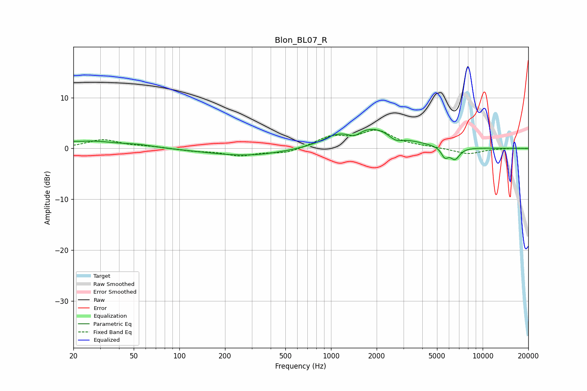

# Blon_BL07_R
See [usage instructions](https://github.com/jaakkopasanen/AutoEq#usage) for more options and info.

### Parametric EQs
Apply preamp of -3.8 dB when using parametric equalizer.

|   # | Type    |   Fc (Hz) |    Q |   Gain (dB) |
|-----|---------|-----------|------|-------------|
|   1 | Peaking |        20 | 5.91 |         0.2 |
|   2 | Peaking |        26 | 0.93 |         1.3 |
|   3 | Peaking |        53 | 1.2  |         0.6 |
|   4 | Peaking |       283 | 0.55 |        -1.5 |
|   5 | Peaking |      1054 | 1.85 |         1.1 |
|   6 | Peaking |      1433 | 3.54 |        -1.1 |
|   7 | Peaking |      1860 | 0.8  |         4.2 |
|   8 | Peaking |      2666 | 3.08 |        -1.3 |
|   9 | Peaking |      5627 | 6    |        -1.8 |
|  10 | Peaking |      6568 | 4.25 |        -2.3 |

### Fixed Band EQs
When using fixed band (also called graphic) equalizer, apply preamp of **-3.7 dB** (if available) and set gains manually with these parameters.

|   # | Type    |   Fc (Hz) |    Q |   Gain (dB) |
|-----|---------|-----------|------|-------------|
|   1 | Peaking |        31 | 1.41 |         1.7 |
|   2 | Peaking |        62 | 1.41 |         0.3 |
|   3 | Peaking |       125 | 1.41 |        -0.4 |
|   4 | Peaking |       250 | 1.41 |        -1.3 |
|   5 | Peaking |       500 | 1.41 |        -1   |
|   6 | Peaking |      1000 | 1.41 |         2.1 |
|   7 | Peaking |      2000 | 1.41 |         3.3 |
|   8 | Peaking |      4000 | 1.41 |         0.2 |
|   9 | Peaking |      8000 | 1.41 |        -1.1 |
|  10 | Peaking |     16000 | 1.41 |         0.1 |

### Graphs

