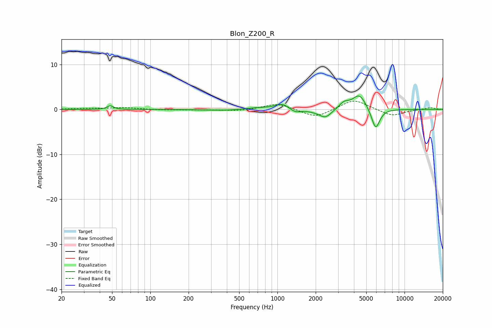

# Blon_Z200_R
See [usage instructions](https://github.com/jaakkopasanen/AutoEq#usage) for more options and info.

### Parametric EQs
Apply preamp of -3.1 dB when using parametric equalizer.

|   # | Type    |   Fc (Hz) |    Q |   Gain (dB) |
|-----|---------|-----------|------|-------------|
|   1 | Peaking |        48 | 6    |         0.8 |
|   2 | Peaking |       396 | 0.98 |        -0.3 |
|   3 | Peaking |       696 | 1.27 |         0.4 |
|   4 | Peaking |      1097 | 2.63 |         1.3 |
|   5 | Peaking |      1376 | 3.25 |        -0.8 |
|   6 | Peaking |      1995 | 1.78 |        -0.3 |
|   7 | Peaking |      2385 | 2.91 |        -1.8 |
|   8 | Peaking |      3341 | 3.56 |         1.4 |
|   9 | Peaking |      4411 | 2.63 |         3.4 |
|  10 | Peaking |      5924 | 4.16 |        -4.7 |

### Fixed Band EQs
When using fixed band (also called graphic) equalizer, apply preamp of **-1.9 dB** (if available) and set gains manually with these parameters.

|   # | Type    |   Fc (Hz) |    Q |   Gain (dB) |
|-----|---------|-----------|------|-------------|
|   1 | Peaking |        31 | 1.41 |         0.2 |
|   2 | Peaking |        62 | 1.41 |         0.4 |
|   3 | Peaking |       125 | 1.41 |        -0.1 |
|   4 | Peaking |       250 | 1.41 |        -0.1 |
|   5 | Peaking |       500 | 1.41 |        -0.3 |
|   6 | Peaking |      1000 | 1.41 |         1.4 |
|   7 | Peaking |      2000 | 1.41 |        -1.9 |
|   8 | Peaking |      4000 | 1.41 |         2.3 |
|   9 | Peaking |      8000 | 1.41 |        -1.5 |
|  10 | Peaking |     16000 | 1.41 |         0.4 |

### Graphs

