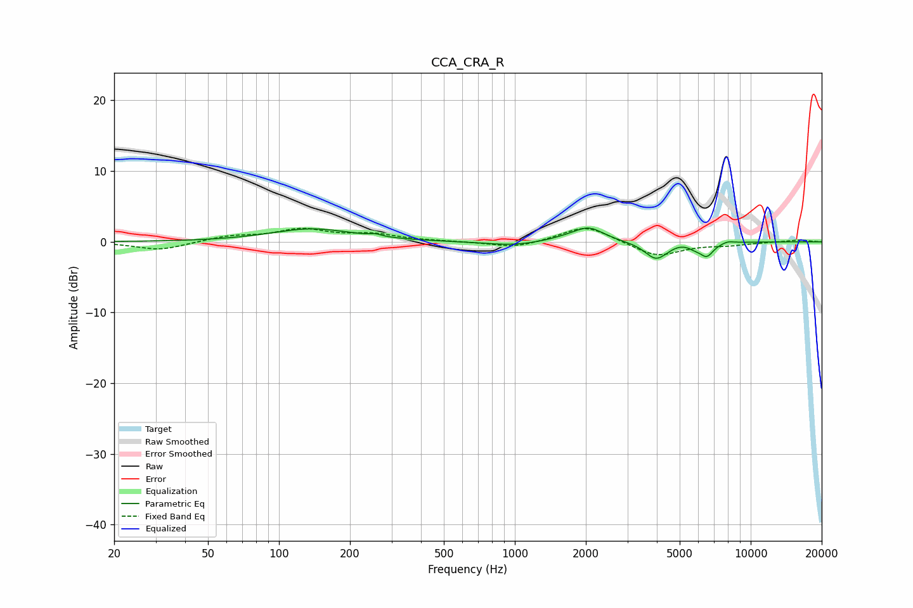

# CCA_CRA_R
See [usage instructions](https://github.com/jaakkopasanen/AutoEq#usage) for more options and info.

### Parametric EQs
Apply preamp of -2.0 dB when using parametric equalizer.

|   # | Type    |   Fc (Hz) |    Q |   Gain (dB) |
|-----|---------|-----------|------|-------------|
|   1 | Peaking |       138 | 0.82 |         1.8 |
|   2 | Peaking |       255 | 5.31 |         0.3 |
|   3 | Peaking |       986 | 1.2  |        -0.6 |
|   4 | Peaking |      1668 | 1.64 |         0.4 |
|   5 | Peaking |      2061 | 2.22 |         1.9 |
|   6 | Peaking |      3972 | 2.95 |        -2.5 |
|   7 | Peaking |      4993 | 4.48 |         0.2 |
|   8 | Peaking |      5805 | 6    |        -0.4 |
|   9 | Peaking |      6504 | 4.67 |        -1.9 |
|  10 | Peaking |      7999 | 4.69 |         0.3 |

### Fixed Band EQs
When using fixed band (also called graphic) equalizer, apply preamp of **-2.0 dB** (if available) and set gains manually with these parameters.

|   # | Type    |   Fc (Hz) |    Q |   Gain (dB) |
|-----|---------|-----------|------|-------------|
|   1 | Peaking |        31 | 1.41 |        -1.2 |
|   2 | Peaking |        62 | 1.41 |         0.8 |
|   3 | Peaking |       125 | 1.41 |         1.6 |
|   4 | Peaking |       250 | 1.41 |         0.9 |
|   5 | Peaking |       500 | 1.41 |         0   |
|   6 | Peaking |      1000 | 1.41 |        -0.9 |
|   7 | Peaking |      2000 | 1.41 |         2.4 |
|   8 | Peaking |      4000 | 1.41 |        -2.1 |
|   9 | Peaking |      8000 | 1.41 |        -0.4 |
|  10 | Peaking |     16000 | 1.41 |         0.3 |

### Graphs

