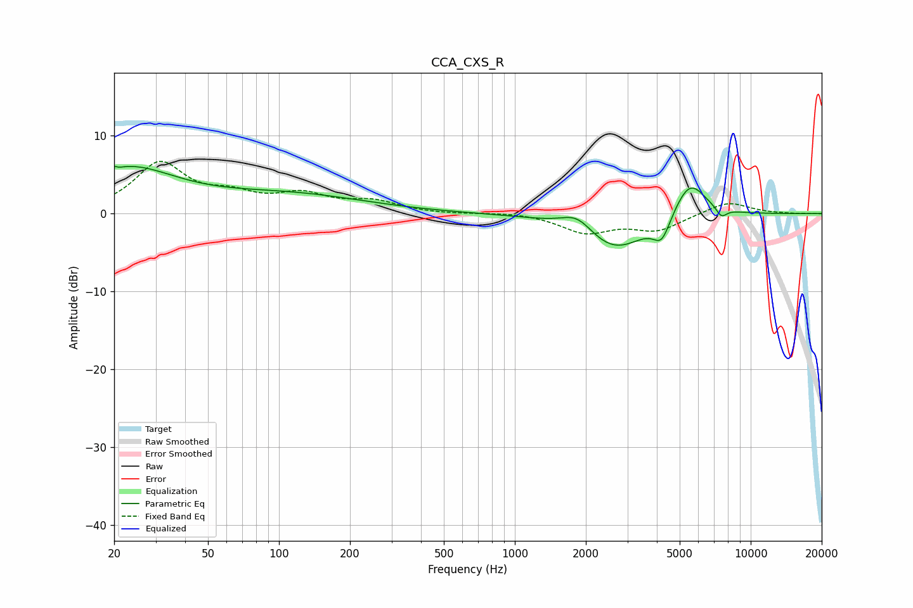

# CCA_CXS_R
See [usage instructions](https://github.com/jaakkopasanen/AutoEq#usage) for more options and info.

### Parametric EQs
Apply preamp of -6.2 dB when using parametric equalizer.

|   # | Type    |   Fc (Hz) |    Q |   Gain (dB) |
|-----|---------|-----------|------|-------------|
|   1 | Peaking |        20 | 1.58 |        -0.5 |
|   2 | Peaking |        20 | 5.17 |         3.7 |
|   3 | Peaking |        21 | 5.64 |        -3.3 |
|   4 | Peaking |        22 | 0.68 |         5.9 |
|   5 | Peaking |       111 | 0.43 |         2.3 |
|   6 | Peaking |      1843 | 2.07 |         2.2 |
|   7 | Peaking |      2636 | 1.01 |        -4.9 |
|   8 | Peaking |      4198 | 3.87 |        -3   |
|   9 | Peaking |      5517 | 1.99 |         4.9 |
|  10 | Peaking |      7512 | 5.93 |        -1.2 |

### Fixed Band EQs
When using fixed band (also called graphic) equalizer, apply preamp of **-6.8 dB** (if available) and set gains manually with these parameters.

|   # | Type    |   Fc (Hz) |    Q |   Gain (dB) |
|-----|---------|-----------|------|-------------|
|   1 | Peaking |        31 | 1.41 |         6.3 |
|   2 | Peaking |        62 | 1.41 |         1.9 |
|   3 | Peaking |       125 | 1.41 |         2.2 |
|   4 | Peaking |       250 | 1.41 |         1.4 |
|   5 | Peaking |       500 | 1.41 |        -0.1 |
|   6 | Peaking |      1000 | 1.41 |         0.2 |
|   7 | Peaking |      2000 | 1.41 |        -2.3 |
|   8 | Peaking |      4000 | 1.41 |        -2   |
|   9 | Peaking |      8000 | 1.41 |         1.6 |
|  10 | Peaking |     16000 | 1.41 |        -0   |

### Graphs

