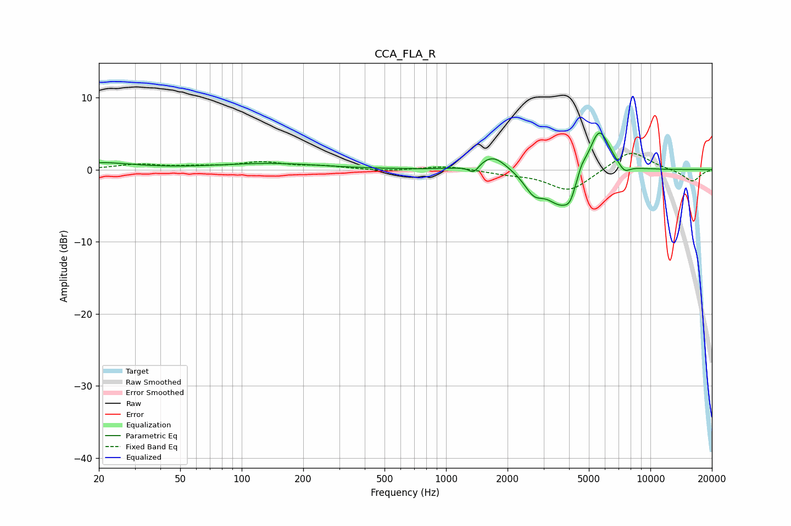

# CCA_FLA_R
See [usage instructions](https://github.com/jaakkopasanen/AutoEq#usage) for more options and info.

### Parametric EQs
Apply preamp of -5.2 dB when using parametric equalizer.

|   # | Type    |   Fc (Hz) |    Q |   Gain (dB) |
|-----|---------|-----------|------|-------------|
|   1 | Peaking |        20 | 0.88 |         0.9 |
|   2 | Peaking |       138 | 0.56 |         0.8 |
|   3 | Peaking |      1366 | 5.74 |        -1.2 |
|   4 | Peaking |      1697 | 2.07 |         2.3 |
|   5 | Peaking |      2688 | 3.12 |        -2.3 |
|   6 | Peaking |      3709 | 1.77 |        -5.3 |
|   7 | Peaking |      4050 | 5.97 |        -1.3 |
|   8 | Peaking |      4599 | 5.98 |         1.3 |
|   9 | Peaking |      5606 | 2.6  |         6.6 |
|  10 | Peaking |      7458 | 4.69 |        -1.2 |

### Fixed Band EQs
When using fixed band (also called graphic) equalizer, apply preamp of **-2.3 dB** (if available) and set gains manually with these parameters.

|   # | Type    |   Fc (Hz) |    Q |   Gain (dB) |
|-----|---------|-----------|------|-------------|
|   1 | Peaking |        31 | 1.41 |         0.7 |
|   2 | Peaking |        62 | 1.41 |         0.3 |
|   3 | Peaking |       125 | 1.41 |         1   |
|   4 | Peaking |       250 | 1.41 |         0.4 |
|   5 | Peaking |       500 | 1.41 |        -0.2 |
|   6 | Peaking |      1000 | 1.41 |         0.5 |
|   7 | Peaking |      2000 | 1.41 |        -0.5 |
|   8 | Peaking |      4000 | 1.41 |        -3   |
|   9 | Peaking |      8000 | 1.41 |         2.8 |
|  10 | Peaking |     16000 | 1.41 |        -1.7 |

### Graphs

