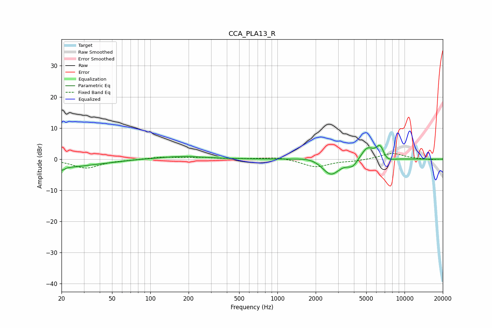

# CCA_PLA13_R
See [usage instructions](https://github.com/jaakkopasanen/AutoEq#usage) for more options and info.

### Parametric EQs
Apply preamp of -4.5 dB when using parametric equalizer.

|   # | Type    |   Fc (Hz) |    Q |   Gain (dB) |
|-----|---------|-----------|------|-------------|
|   1 | Peaking |        20 | 5.81 |        -1.4 |
|   2 | Peaking |        24 | 0.81 |        -2.3 |
|   3 | Peaking |        48 | 1.17 |        -0.4 |
|   4 | Peaking |       179 | 0.8  |         0.9 |
|   5 | Peaking |      1863 | 1.46 |         1   |
|   6 | Peaking |      2630 | 2.03 |        -5.3 |
|   7 | Peaking |      3900 | 3.67 |        -2.2 |
|   8 | Peaking |      5082 | 2.9  |         3.8 |
|   9 | Peaking |      6446 | 3.97 |         4.8 |
|  10 | Peaking |      7126 | 2.88 |        -1.9 |

### Fixed Band EQs
When using fixed band (also called graphic) equalizer, apply preamp of **-1.9 dB** (if available) and set gains manually with these parameters.

|   # | Type    |   Fc (Hz) |    Q |   Gain (dB) |
|-----|---------|-----------|------|-------------|
|   1 | Peaking |        31 | 1.41 |        -2.9 |
|   2 | Peaking |        62 | 1.41 |        -0.2 |
|   3 | Peaking |       125 | 1.41 |         0.7 |
|   4 | Peaking |       250 | 1.41 |         0.5 |
|   5 | Peaking |       500 | 1.41 |         0   |
|   6 | Peaking |      1000 | 1.41 |         0.7 |
|   7 | Peaking |      2000 | 1.41 |        -2.5 |
|   8 | Peaking |      4000 | 1.41 |        -0.5 |
|   9 | Peaking |      8000 | 1.41 |         1.9 |
|  10 | Peaking |     16000 | 1.41 |        -0.2 |

### Graphs

