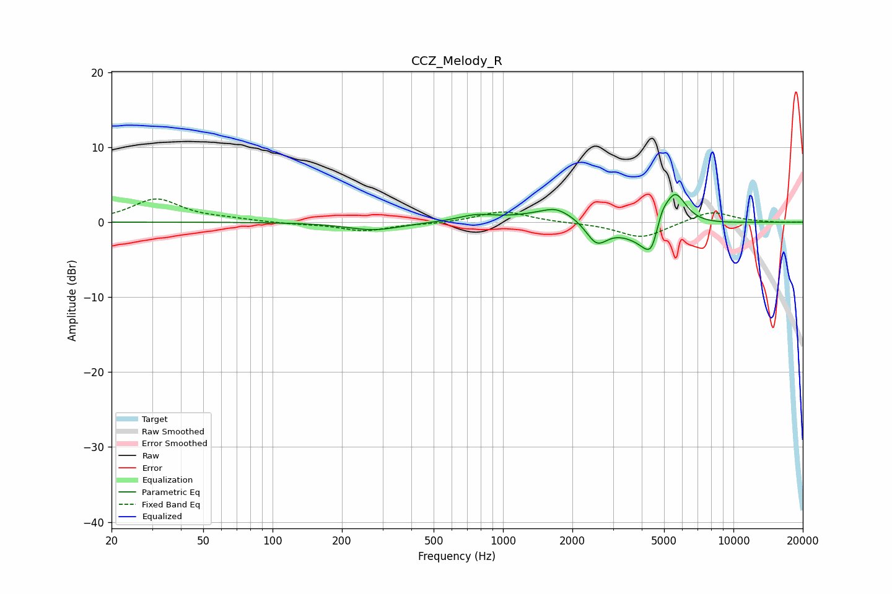

# CCZ_Melody_R
See [usage instructions](https://github.com/jaakkopasanen/AutoEq#usage) for more options and info.

### Parametric EQs
Apply preamp of -3.8 dB when using parametric equalizer.

|   # | Type    |   Fc (Hz) |    Q |   Gain (dB) |
|-----|---------|-----------|------|-------------|
|   1 | Peaking |       275 | 1.21 |        -1.1 |
|   2 | Peaking |       766 | 1.81 |         0.8 |
|   3 | Peaking |      1688 | 2.91 |         0.6 |
|   4 | Peaking |      1770 | 1.01 |         1.8 |
|   5 | Peaking |      2546 | 2.93 |        -3.1 |
|   6 | Peaking |      4129 | 5.18 |        -0.6 |
|   7 | Peaking |      4342 | 1.34 |        -3.7 |
|   8 | Peaking |      4416 | 6    |        -1.9 |
|   9 | Peaking |      4903 | 6    |         1.5 |
|  10 | Peaking |      5541 | 2.64 |         5.9 |

### Fixed Band EQs
When using fixed band (also called graphic) equalizer, apply preamp of **-3.2 dB** (if available) and set gains manually with these parameters.

|   # | Type    |   Fc (Hz) |    Q |   Gain (dB) |
|-----|---------|-----------|------|-------------|
|   1 | Peaking |        31 | 1.41 |         3   |
|   2 | Peaking |        62 | 1.41 |         0.3 |
|   3 | Peaking |       125 | 1.41 |        -0.2 |
|   4 | Peaking |       250 | 1.41 |        -1.2 |
|   5 | Peaking |       500 | 1.41 |        -0.2 |
|   6 | Peaking |      1000 | 1.41 |         1.5 |
|   7 | Peaking |      2000 | 1.41 |        -0.1 |
|   8 | Peaking |      4000 | 1.41 |        -2.1 |
|   9 | Peaking |      8000 | 1.41 |         1.5 |
|  10 | Peaking |     16000 | 1.41 |        -0.1 |

### Graphs

