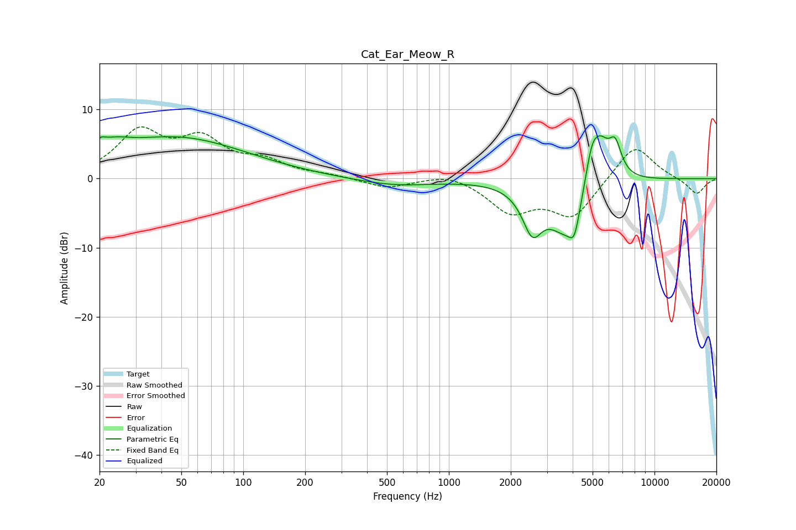

# Cat_Ear_Meow_R
See [usage instructions](https://github.com/jaakkopasanen/AutoEq#usage) for more options and info.

### Parametric EQs
Apply preamp of -6.3 dB when using parametric equalizer.

|   # | Type    |   Fc (Hz) |    Q |   Gain (dB) |
|-----|---------|-----------|------|-------------|
|   1 | Peaking |        20 | 5.64 |         1.1 |
|   2 | Peaking |        23 | 1.77 |         1.6 |
|   3 | Peaking |        47 | 0.41 |         5.9 |
|   4 | Peaking |       546 | 0.75 |        -1   |
|   5 | Peaking |      2545 | 2.92 |        -5.9 |
|   6 | Peaking |      3655 | 1.65 |        -6.9 |
|   7 | Peaking |      4081 | 5.23 |        -4   |
|   8 | Peaking |      4955 | 4.28 |         4.5 |
|   9 | Peaking |      5464 | 2.96 |         5.4 |
|  10 | Peaking |      6439 | 4.36 |         4.4 |

### Fixed Band EQs
When using fixed band (also called graphic) equalizer, apply preamp of **-7.6 dB** (if available) and set gains manually with these parameters.

|   # | Type    |   Fc (Hz) |    Q |   Gain (dB) |
|-----|---------|-----------|------|-------------|
|   1 | Peaking |        31 | 1.41 |         6.4 |
|   2 | Peaking |        62 | 1.41 |         5   |
|   3 | Peaking |       125 | 1.41 |         2.1 |
|   4 | Peaking |       250 | 1.41 |         0.4 |
|   5 | Peaking |       500 | 1.41 |        -1.4 |
|   6 | Peaking |      1000 | 1.41 |         1   |
|   7 | Peaking |      2000 | 1.41 |        -4.5 |
|   8 | Peaking |      4000 | 1.41 |        -5.4 |
|   9 | Peaking |      8000 | 1.41 |         5.2 |
|  10 | Peaking |     16000 | 1.41 |        -2.3 |

### Graphs

